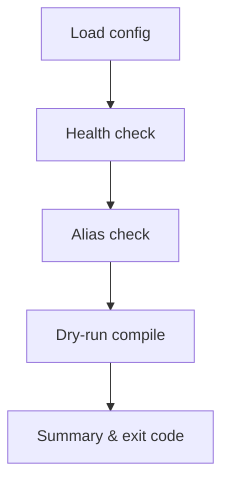

[← Back to Index](./index.md) · [Schema](./schema.md) · [Indexer](./indexer.md)

# CLI

Operator-focused tasks for schema lifecycle and indexing. All tasks are thin facades over documented APIs with small, structured instrumentation.

## Commands

```bash
rails search_engine:schema:diff[collection]
rails search_engine:schema:apply[collection]
rails search_engine:schema:rollback[collection]
rails search_engine:index:rebuild[collection]
rails search_engine:index:rebuild_partition[collection,partition]
rails search_engine:index:delete_stale[collection,partition]
rails search_engine:doctor
```

- **collection**: either a fully-qualified class name (e.g., `SearchEngine::Product`) or a logical identifier (e.g., `product`/`products`).
- **partition**: opaque partition key. Numeric strings are parsed as integers; otherwise treated as strings.

## Usage

- Show tasks: `rails -T | grep search_engine`
- Diff schema: `rails search_engine:schema:diff[SearchEngine::Product]`
- Apply schema: `rails search_engine:schema:apply[products]`
- Rollback schema: `rails search_engine:schema:rollback[products]`
- Rebuild all partitions: `rails search_engine:index:rebuild[SearchEngine::Product]`
- Rebuild a partition: `rails search_engine:index:rebuild_partition[SearchEngine::Product,42]`
- Delete stale docs: `rails search_engine:index:delete_stale[products,42]`
- Doctor diagnostics: `rails search_engine:doctor`

Tip about commas: quote or avoid spaces inside brackets.

```bash
rails search_engine:index:rebuild_partition[SearchEngine::Product,42]
```

## Environment flags

- `DRY_RUN=1`: For `index:rebuild`, preview first batch only (no HTTP); for `index:delete_stale`, show filter hash and estimation (if enabled) without deleting.
- `DISPATCH=inline|active_job`: Override dispatch mode for rebuild tasks (defaults from config).
- `VERBOSE=1`: Print additional details (e.g., schema diff JSON and dry-run sample line). For `doctor`, shows untruncated hints.
- `FORMAT=json`: Machine-readable output. For `doctor`, prints `{ ok, summary, checks }`.
- `STRICT=1`: For `index:delete_stale`, treat missing filter as violation.
- `TIMEOUT=seconds`: For `doctor`, override per-request timeout for health/API calls.
- `HOST`/`PORT`/`PROTOCOL`: For `doctor`, temporary overrides to test connectivity.

## Exit codes

| Code | Meaning                             |
| ---- | ----------------------------------- |
| 0    | Success                             |
| 1    | Error                               |
| 2    | Rollback not possible               |
| 3    | Strict safety violation             |
| 10   | Schema drift detected (diff)        |

## Behavior summary

- `schema:diff`: Compares compiled schema vs the active physical (via alias). Prints compact summary; `VERBOSE=1` dumps details. Exits `10` when drift exists.
- `schema:apply`: Creates a new physical, reindexes (all partitions), swaps alias, drops old physicals per retention. Prints a compact summary.
- `schema:rollback`: Swaps alias to previous retained physical. Exits `2` when none available.
- `index:rebuild`: If `partitions` DSL exists, enumerates and dispatches per partition; otherwise a single inline run. `DRY_RUN=1` maps only the first batch and prints a preview.
- `index:rebuild_partition`: Rebuilds a single partition; respects `DISPATCH` or config defaults.
- `index:delete_stale`: Uses `stale_filter_by` to delete by filter. If not defined: warns and exits `0`, or `3` with `STRICT=1`. `DRY_RUN=1` prints preview without deleting.
- `doctor`: Validates config/ENV presence, connectivity (health), API key validity, alias resolution for registered collections, compiles a dry-run single search and a multi-search without I/O, reports logging mode, and OpenTelemetry status. Prints a human-readable table by default or JSON with `FORMAT=json`. Exits `1` on any failure.

### Doctor flow



Backlinks: [Observability](./observability.md#opentelemetry), [Installation](./installation.md), [Configuration](./configuration.md)


See also: [Configuration](./configuration.md) and [Observability](./observability.md#opentelemetry) for logging and OTel.

## Safety notes

- Stale deletes never run with an empty filter. A short hash of the filter is printed for traceability.
- Partition keys are opaque. Numeric strings are converted to integers; other values remain strings.

## See also

- [Schema](./schema.md) — compiler, diff, apply! and rollback
- [Indexer](./indexer.md) — import flow, dry-run, partitioning, dispatcher
- [Observability](./observability.md)

