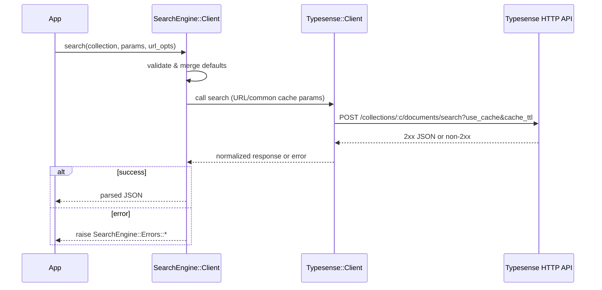

[← Back to Index](./index.md)

Related: [Installation](./installation.md), [Configuration](./configuration.md), [Observability](./observability.md)

## SearchEngine::Client

A thin wrapper around the official `typesense` Ruby gem that provides single-search and federated multi-search. It enforces that cache knobs live in URL/common params (never in per-search bodies) and normalizes gem/network failures into `SearchEngine::Errors`.

### Usage

```ruby
client = SearchEngine::Client.new
client.search(collection: "products", params: { q: "milk", query_by: "name" }, url_opts: { use_cache: true })
client.multi_search(
  searches: [
    { collection: "products", q: "milk", query_by: "name", per_page: 5 },
    { collection: "brands",   q: "mil",  query_by: "name", per_page: 3 }
  ],
  url_opts: { use_cache: true, cache_ttl: 30 }
)

# Top-level convenience returning raw
SearchEngine.multi_search_raw(common: { query_by: SearchEngine.config.default_query_by }) do |m|
  m.add :products, Product.per(5)
  m.add :brands,   Brand.per(3)
end
```

### Request flow



### URL/common params vs body

| Parameter   | Location    |
|-------------|-------------|
| `use_cache` | URL/Common  |
| `cache_ttl` | URL/Common  |
| `q`         | Body/Params |
| `query_by`  | Body/Params |
| `filter_by` | Body/Params |
| `per_page`  | Body/Params |

### Errors

Public errors are exposed via `SearchEngine::Errors`:

- `Timeout`: request exceeded timeout budget
- `Connection`: DNS/socket/TLS/connect failures
- `Api`: non‑2xx Typesense responses (carries `status` and `body`)
- `InvalidParams`: wrapper pre‑call validation problems

See `lib/search_engine/errors.rb` for details.

### Internals boundary

- `SearchEngine::Client::RequestBuilder` assembles concrete request shapes (HTTP method, path, body) from compiled params. It has no network concerns.
- `SearchEngine::Client::HttpAdapter` executes an assembled request using the injected `Typesense::Client`. It has no knowledge of Typesense domain semantics.
- These roles clarify responsibilities; there is no change to public behavior.

#### Troubleshooting

- **Timeout / Connection**: Check host/port/protocol and network reachability.
- **API errors**: Inspect `status` and server body. 4xx are not retried; 5xx/429 may be transient.

Backlinks: [README](../README.md)

See [Observability](./observability.md) for emitted events and compact logging.
