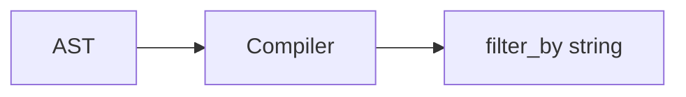

[← Back to Index](./index.md) · [Relation](./relation.md) · [Query DSL](./query_dsl.md)

> Instrumentation: `search_engine.compile` is emitted by the compiler. See [Debugging](./debugging.md).

# Compiler (AST → Typesense `filter_by`)

The compiler turns a Predicate AST under `SearchEngine::AST` into a deterministic Typesense `filter_by` string. It is pure (no I/O), safe (centralized quoting/escaping), and consistent with the `where` DSL.

## Overview

- **Deterministic**: same AST → same string; no globals.
- **Safe quoting**: uses `SearchEngine::Filters::Sanitizer` for all values.
- **Parentheses & precedence**: explicit, predictable rules (`And` > `Or`).
- **Escape hatch**: `AST::Raw` is passed through as-is.



## Node mapping

| AST node | Syntax |
| --- | --- |
| `Eq(field, value)` | `field:=VALUE` |
| `NotEq(field, value)` | `field:!=VALUE` |
| `Gt(field, value)` | `field:>VALUE` |
| `Gte(field, value)` | `field:>=VALUE` |
| `Lt(field, value)` | `field:<VALUE` |
| `Lte(field, value)` | `field:<=VALUE` |
| `In(field, [v1, v2])` | `field:=[V1, V2]` |
| `NotIn(field, [v1, v2])` | `field:!=[V1, V2]` |
| `And(n1, n2, ...)` | `... && ...` |
| `Or(n1, n2, ...)` | `... || ...` |
| `Group(child)` | `( ... )` |
| `Raw(fragment)` | passthrough |

- `Matches` / `Prefix`: Typesense `filter_by` does not support these forms; compilation raises `UnsupportedNode`. Use `AST::Raw` for adapter-specific fragments if needed.

## Quoting & types

Values are rendered via `Filters::Sanitizer.quote`:

- **String**: double-quoted, with minimal escaping for `\` and `"`.
- **Boolean**: `true`/`false`.
- **Nil**: `null`.
- **Numeric**: as-is.
- **Time/Date/DateTime**: ISO8601 string (quoted). Upstream parsing coerces Date/DateTime to `Time.utc`.
- **Array**: one-level flatten; each element quoted; wrapped as `[a, b]`.

## Precedence & parentheses

- Precedence: `And` = 20, `Or` = 10. Leaves bind tighter.
- `Group` always inserts parentheses.
- Parentheses are added when a child has lower precedence than its parent.
- Whitespace: single spaces around `&&` and `||`.

## Examples

```ruby
Compiler.compile(AST.and_(AST.eq(:active, true), AST.in_(:brand_id, [1, 2])), klass: Product)
# => "active:=true && brand_id:=[1, 2]"

Compiler.compile(AST.or_(AST.eq(:a, 1), AST.and_(AST.eq(:b, 2), AST.eq(:c, 3))))
# => "a:=1 || (b:=2 && c:=3)"

Compiler.compile(AST.group(AST.or_(AST.eq(:a, 1), AST.eq(:b, 2))))
# => "(a:=1 || b:=2)"

Compiler.compile([AST.eq(:x, 1), AST.eq(:y, 2)])
# => "x:=1 && y:=2"
```

## Integration

- `Relation#to_typesense_params` prefers compiling `ast` when present, falling back to legacy string `filters` for backward compatibility.
- `Raw` fragments are preserved through the pipeline.

See also: [Relation](./relation.md) · [Query DSL](./query_dsl.md)
