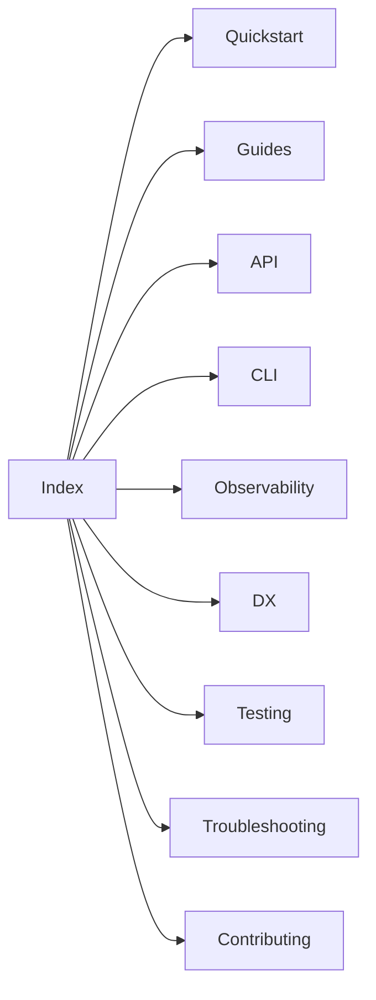

[← Back to Index](../index.md)

# Docs style guide

Use this guide to keep docs consistent, clear, and easy to navigate.

- **Audience**: Ruby/Rails engineers integrating the engine
- **Scope**: Markdown under `docs/` only (no code changes here)
- **Nav rules**: Each page starts with the backlink line and includes a short Related block

## Tone & clarity

- Be direct and actionable. Prefer examples over abstract prose
- Avoid jargon; define terms on first use
- Use short paragraphs and bullet lists; keep lines ≤100 chars
- Prefer present tense and active voice

## Headings & anchors

- Use sentence‑case headings (e.g., “Schema compiler” not “SCHEMA COMPILER”)
- Keep heading levels consistent within a page
- Use hyphenated, lower‑case anchors in links (GitHub generates them automatically)
- Keep section names stable; avoid churn that would break anchors

## Code fences

- Always specify a language: `ruby`, `bash`, `json`, `yaml`, `mermaid`, `text`
- Keep examples minimal and runnable; redact secrets (e.g., `***`)
- Fit lines ≤100 chars; wrap long command outputs with `text`

Good

```ruby
SearchEngine.configure do |c|
  c.host = "localhost"
end
```

Bad

```ruby
SearchEngine.configure do |c| c.host = "localhost"; c.port = 8108; end
```

## Mermaid diagrams

- Prefer small diagrams (≤ ~15 nodes) with clear labels
- Use concise titles when helpful
- Keep labels consistent with section names in `docs/index.md`

Example



## Backlinks & related links

- Put this exact backlink line at the very top of every page (adjust the relative path when inside subfolders):

```md
[← Back to Index](../index.md)
```

- Add a compact Related block with 2–4 nearby links (use relative links):

```md
Related: [Observability](../observability.md), [DX](../dx.md), [Testing](../testing.md)
```

## Link phrasing

- Prefer descriptive anchors: “See Observability → Logging” instead of “click here”
- Use relative links within `/docs`; no bare URLs—wrap in backticks or use markdown links

Good

```md
See [Observability → Logging](./observability.md#logging).
```

Bad

```md
Click [here](./observability.md#logging).
```

## Cross-referencing with YARDoc

- When public APIs are introduced or changed, update docs and YARDoc together
- Use `@see` to link from YARDoc back to the exact docs anchor

Example

```ruby
# Compiles the schema for a collection.
#
# See docs/schema.md#api for the API overview and return shape
# Returns a deeply frozen Typesense-compatible schema (Hash)
```

## Examples: good vs bad

Headings

- Good: “# Schema compiler & diff”
- Bad: “# schema COMPILER and DIFF”

Code blocks

- Good: separate statements on new lines; language specified
- Bad: one‑line scripts; no language tag

Links

- Good: “See [Testing → Stub client](./testing.md#stub-client)”
- Bad: “see here” with no anchor

## Reusable snippets

Backlink line

```md
[← Back to Index](../index.md)
```

Related block template

```md
Related: [Observability](../observability.md), [DX](../dx.md), [Testing](../testing.md)
```

Troubleshooting callout

```md
> Having trouble? See [Troubleshooting](./troubleshooting.md#common-issues) for fixes.
```

## Acceptance criteria snippets

Include the following in acceptance criteria:

- “All new/edited docs must include the top backlink line, related links, and cross‑links to Observability/Troubleshooting where relevant.”
- “Public APIs touched by this ticket must be referenced in docs and YARDoc with `@see` links back to the relevant docs section.”

Related: [Index](../index.md), [Troubleshooting](../troubleshooting.md)
