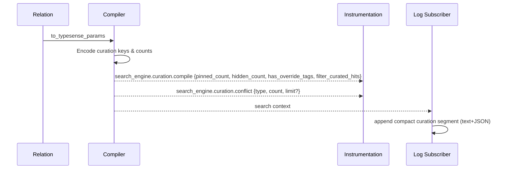

[← Back to Index](./index.md)

# Curation

Related: [Observability](./observability.md#logging), [Troubleshooting → Curation](./troubleshooting.md#curation)

[See also: Observability](./observability.md#logging)

Curate results by pinning or hiding specific IDs, optionally tagging with override tags, and optionally filtering hidden hits from the materialized view. Purely declarative; encoded as body params only.

## Overview

- **Pin** hits by ID to the top of results (stable first-occurrence order)
- **Hide** hits by ID (hide-wins when an ID is both pinned and hidden)
- **Override tags** are optional body-only tags
- **Filter flag** `filter_curated_hits` optionally excludes hidden hits from the curated view
- **Composes with** selection, presets, grouping, pagination; does not alter URL/common params

## DSL

Immutable chainers on `Relation` (copy-on-write). Inputs are normalized (coerced to String, blank dropped), arrays flattened one level, and lists de-duplicated while preserving first occurrence order.

- `pin(*ids)` — append to pinned list (stable-dedupe)
- `hide(*ids)` — append to hidden list (set semantics)
- `curate(pin: [], hide: [], override_tags: [], filter_curated_hits: nil|true|false)` — replace provided keys; omit to retain
- `clear_curation` — remove all curation state from the relation

State shape on the relation:

- `pinned: Array<String>`
- `hidden: Array<String>`
- `override_tags: Array<String>`
- `filter_curated_hits: true | false | nil`

Inspect/explain:

- `inspect` emits a compact token only when non-empty, e.g. `curation=p:[p_12,p_34]|h:[p_99]|tags:[homepage]|fch:false`
- `explain` adds a concise curation summary and a conflicts line when overlaps/limits occur

Insert:

```ruby
# Pin two products to the top and hide one, with an override tag
SearchEngine::Product
  .pin("p_12", "p_34")
  .hide("p_99")
  .curate(override_tags: ["homepage"], filter_curated_hits: false)

# One‑shot
SearchEngine::Product.curate(pin: %w[p_12 p_34], hide: %w[p_99], override_tags: %w[homepage])
```

## Compiler mapping

Curation state maps to Typesense body params and never appears in URL/common params. Empty arrays are omitted; `filter_curated_hits` is omitted when `nil`.

| State key             | Example value             | Param key             | Encoded value         |
| --------------------- | ------------------------- | --------------------- | --------------------- |
| `pinned`              | `["p_1","p_2"]`             | `pinned_hits`         | `"p_1,p_2"`             |
| `hidden`              | `"p9"`                    | `hidden_hits`         | `"p9"`                |
| `override_tags`       | `["homepage","campaign"]` | `override_tags`       | `"homepage,campaign"` |
| `filter_curated_hits` | `true`                    | `filter_curated_hits` | `true`                |

- Keys are omitted when arrays are empty or when `filter_curated_hits` is `nil`
- Ordering is deterministic; `pinned` preserves first-occurrence order

```mermaid
flowchart TD
  A[Relation.curation state] --> B[Encoder in to_typesense_params]
  B --> C{present?}
  C -- pinned --> D[pinned_hits: join(',')]
  C -- hidden --> E[hidden_hits: join(',')]
  C -- tags --> F[override_tags: join(',')]
  C -- filter --> G[filter_curated_hits: boolean]
  D --> H[Body params]
  E --> H
  F --> H
  G --> H
```

Insert:

```ruby
rel = SearchEngine::Product
        .curate(pin: %w[p_1 p_2], hide: %w[p9], override_tags: %w[homepage], filter_curated_hits: true)
rel.to_typesense_params
# => {
#   q: "*", query_by: "name, description",
#   pinned_hits: "p_1,p_2", hidden_hits: "p9",
#   filter_curated_hits: true, override_tags: "homepage"
# }
```

## Guardrails & errors

Validation is applied after normalization. Overlaps and limits are recorded for `explain` and observability.

### Rules

| Rule | Behavior |
| --- | --- |
| ID format | `SearchEngine.config.curation.id_regex` (default `/\A[\w\-:\.]+\z/`) applied to curated IDs and override tags |
| Deduplication | `pinned` stable-dedupes (first occurrence wins); `hidden` set-dedupes (first-seen order preserved) |
| Limits | `max_pins` (default 50) and `max_hidden` (default 200) enforced post-normalization |
| Precedence | When an ID exists in both lists, **hide wins** (removed from `pinned`, recorded as conflict) |

### Errors

| Error | When |
| --- | --- |
| `InvalidCuratedId` | Curated ID fails the allowed pattern |
| `CurationLimitExceeded` | Pinned or hidden list exceeds configured limit |
| `InvalidOverrideTag` | Override tag is blank or fails the allowed pattern |

Config example:

```ruby
SearchEngine.configure do |c|
  c.curation = OpenStruct.new(max_pins: 50, max_hidden: 200, id_regex: /\A[\w\-:\.]+\z/)
end
```

## Multi-search

Per-search independence: each `m.add` relation carries its own curation keys in its body. Pinned order is preserved; omission rules apply; `filter_curated_hits` is scoped per entry.

Insert:

```ruby
res = SearchEngine.multi_search do |m|
  m.add :products, SearchEngine::Product.curate(pin: %w[p_1 p_2])
  m.add :brands,   SearchEngine::Brand.curate(hide: %w[b9 b10], filter_curated_hits: true)
end
```

See also: [Multi‑search](./multi_search.md#curation-in-multi-search)

## Materializers & explain

Materializers reuse the memoized single response and apply curation in-memory.

- Ordering: pins first (declared order, present IDs only), then remainder in original order. **Hide-wins**.
- Filtering: when `filter_curated_hits: true`, hidden hits are excluded from iteration and counts.
- Counts: when filtering is on, `count` reflects the curated view size; `exists?` follows server totals. To check curated emptiness, use `count > 0`.
- `explain` adds a curation summary and a conflicts line.

Explain excerpt:

```
Curation: pinned=2 hidden=1 filter_curated_hits=false override_tags=[homepage]
Conflicts: [p_1 (both pinned & hidden → hidden)]
```

```mermaid
flowchart TD
  R[Memoized response hits] --> P[Build pinned segment (declared order, present IDs only)]
  R --> U[Unpinned remainder (original order)]
  P --> O[Concatenate]
  U --> O
  O --> F{filter_curated_hits?}
  F -- yes --> X[Drop hidden]
  F -- no --> Y[Keep hidden]
  X --> V[Curated view (materializers iterate)]
  Y --> V[Curated view (materializers iterate)]
```

## Observability

Events are counts/flags only; IDs/tags are redacted. A compact logging subscriber appends a short curation segment to single-search lines and structured JSON fields when present.

- `search_engine.curation.compile` — once per compile when curation state exists
  - Payload: `pinned_count`, `hidden_count`, `has_override_tags`, `filter_curated_hits`
- `search_engine.curation.conflict` — emitted when overlaps or limits are detected; at most once per compile
  - Payload: `type` (`:overlap`|`:limit_exceeded`), `count`, optional `limit`

Compact logging (examples; no IDs/tags):

- Text: `[se.search] collection=products status=200 duration=12.3ms cu=p:2|h:1|f:false|t:1`
- JSON: `{ "event":"search", "collection":"products", "curation_pinned_count":2, "curation_hidden_count":1, "curation_has_override_tags":true, "curation_filter_flag":false }`



## FAQ

- **How does hide‑wins work?** If the same ID appears in both lists, it is removed from `pinned` and treated as hidden. The conflict is visible in `explain` and emitted once via `search_engine.curation.conflict`.
- **Why are curation keys body‑only?** They are Typesense body params and never belong to URL/common params. This keeps caches and logs clean and minimizes risk of leakage.
- **How are limits enforced?** After normalization and dedupe. When a list exceeds the configured limit, it is truncated and `CurationLimitExceeded` is raised. A conflict event with `type: :limit_exceeded` is also emitted.
- **Does curation change pagination?** No. It only affects the curated in‑memory view. Pagination/search execution semantics remain unchanged.
- **What if a pinned ID isn’t present in the response?** It is ignored for ordering; only IDs present in the current page are surfaced.
- **How does curation interact with presets or selection?** Curation composes orthogonally. Presets affect compiled params; selection controls hydrated fields. Curation doesn’t add extra requests and respects the effective selection during hydration.

---

Backlinks: [Index](./index.md) · [Relation](./relation.md) · [Compiler](./compiler.md) · [Multi‑search](./multi_search.md) · [Materializers](./materializers.md) · [Observability](./observability.md)
