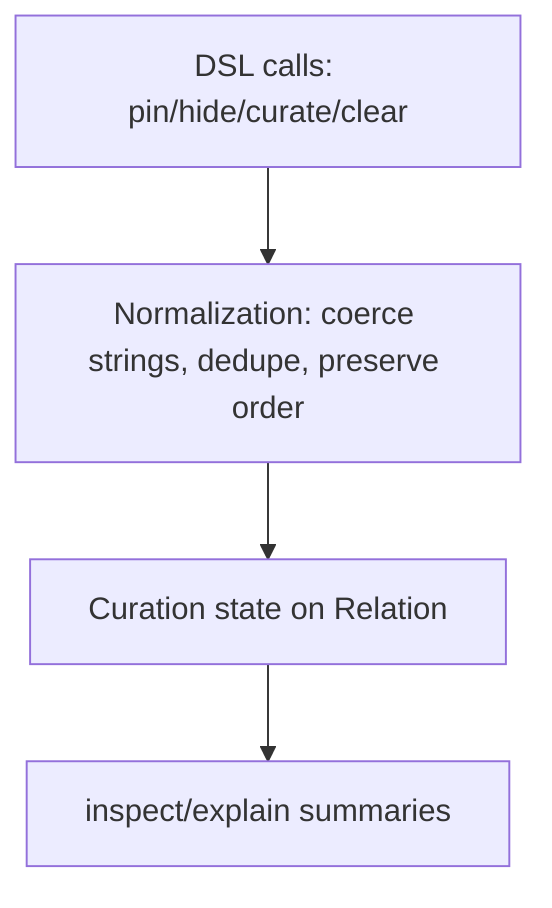

[← Back to Index](./index.md) · [Relation](./relation.md) · [Compiler](./compiler.md)

## Curation DSL (pin/hide/curate/clear)

Immutable chainers to curate hits by ID and apply optional override tags.

### Overview

- Pin hits by ID to the top of results
- Hide hits by ID
- Optionally apply override tags
- Optional filtering switch for curated hits

```ruby
# Pin two products to the top and hide one, with an override tag
SearchEngine::Product
  .pin("p_12", "p_34")
  .hide("p_99")
  .curate(override_tags: ["homepage"], filter_curated_hits: false)

# One‑shot
SearchEngine::Product.curate(pin: %w[p_12 p_34], hide: %w[p_99], override_tags: %w[homepage])
```

### Normalization & State

State is normalized and stored on the relation as:

- pinned: Array<String> (deduped, first occurrence order preserved)
- hidden: Array<String> (deduped, first-seen order preserved)
- override_tags: Array<String>
- filter_curated_hits: true | false | nil

### DSL

- pin(*ids): append IDs to pinned (stable-dedupe; preserves first occurrence order)
- hide(*ids): append IDs to hidden (set semantics; preserves first-seen order)
- curate(pin: [], hide: [], override_tags: [], filter_curated_hits: nil): replace provided keys; omit to retain
- clear_curation: remove all curation state

### Inspect / Explain

- Inspect adds a compact token only when non-empty, e.g. `curation=p:[p_12,p_34]|h:[p_99]|tags:[homepage]|fch:false`
- Explain adds multi-line summary lines:
  - Pinned: p_12, p_34
  - Hidden: p_99
  - Override tags: homepage
  - Filter curated hits: false

### Diagram


