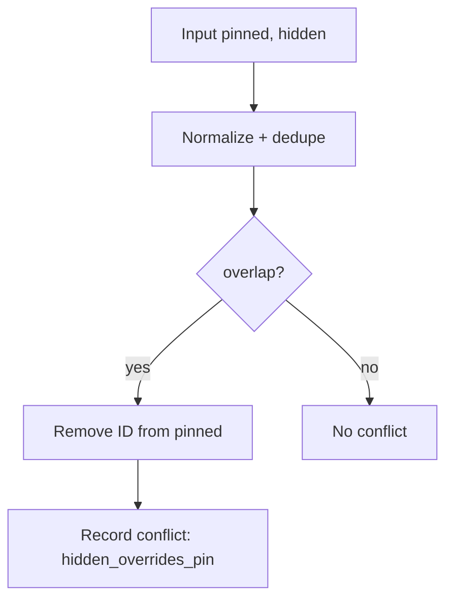
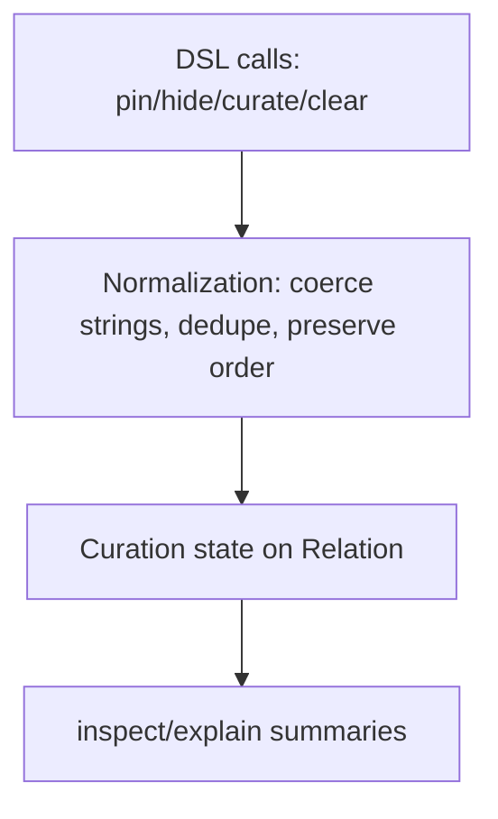

[← Back to Index](./index.md) · [Relation](./relation.md) · [Compiler](./compiler.md)

## Curation DSL (pin/hide/curate/clear)

Immutable chainers to curate hits by ID and apply optional override tags.

### Overview

- Pin hits by ID to the top of results
- Hide hits by ID
- Optionally apply override tags
- Optional filtering switch for curated hits

```ruby
# Pin two products to the top and hide one, with an override tag
SearchEngine::Product
  .pin("p_12", "p_34")
  .hide("p_99")
  .curate(override_tags: ["homepage"], filter_curated_hits: false)

# One‑shot
SearchEngine::Product.curate(pin: %w[p_12 p_34], hide: %w[p_99], override_tags: %w[homepage])
```

### Normalization & State

State is normalized and stored on the relation as:

- pinned: Array<String> (deduped, first occurrence order preserved)
- hidden: Array<String> (deduped, first-seen order preserved)
- override_tags: Array<String>
- filter_curated_hits: true | false | nil

### DSL

- pin(*ids): append IDs to pinned (stable-dedupe; preserves first occurrence order)
- hide(*ids): append IDs to hidden (set semantics; preserves first-seen order)
- curate(pin: [], hide: [], override_tags: [], filter_curated_hits: nil): replace provided keys; omit to retain
- clear_curation: remove all curation state

### Inspect / Explain

- Inspect adds a compact token only when non-empty, e.g. `curation=p:[p_12,p_34]|h:[p_99]|tags:[homepage]|fch:false`
- Explain adds multi-line summary lines:
  - Pinned: p_12, p_34
  - Hidden: p_99
  - Override tags: homepage
  - Filter curated hits: false

### Guardrails & errors

- Rules
  - **ID format**: all curated IDs and override tags must match `SearchEngine.config.curation.id_regex` (default: `/\A[\w\-:\.]+\z/`).
  - **Deduplication**: `pinned` stable-dedupes (first occurrence wins); `hidden` set-dedupes (first-seen order preserved).
  - **Limits**: `max_pins` (default 50) and `max_hidden` (default 200) enforced after normalization and precedence.
  - **Precedence**: when an ID appears in both `pinned` and `hidden`, **hide wins** — the ID is removed from `pinned` and recorded as a conflict. Explain shows: `Conflicts: <ids> (hidden overrides pin)`.

- Errors
  - `InvalidCuratedId`: `"<id>" is not a valid curated ID. Expected pattern: <regex>. Try removing illegal characters.`
  - `CurationLimitExceeded`: `pinned list exceeds max_pins=<N> (attempted <M>). Reduce inputs or raise the limit in SearchEngine.config.curation.` (similarly for `hidden`).
  - `InvalidOverrideTag`: `"<tag>" is invalid. Use non-blank strings that match the allowed pattern.`

- Config knobs

```ruby
SearchEngine.configure do |c|
  c.curation = OpenStruct.new(max_pins: 50, max_hidden: 200, id_regex: /\A[\w\-:\.]+\z/)
end
```

- Mermaid — precedence



Backlinks: [Index](./index.md) · [Relation](./relation.md) · [Compiler](./compiler.md) · [Multi‑search](./multi_search.md#curation-in-multi-search)

### Diagram



### Mapping to Typesense params

| State key             | Example value             | Param key             | Encoded value         |
| --------------------- | ------------------------- | --------------------- | --------------------- |
| `pinned`              | `["p1","p2"]`             | `pinned_hits`         | `"p1,p2"`             |
| `hidden`              | ``"p9"``                  | `hidden_hits`         | `"p9"`                |
| `override_tags`       | `["homepage","campaign"]` | `override_tags`       | `"homepage,campaign"` |
| `filter_curated_hits` | `true`                    | `filter_curated_hits` | `true`                |

- Keys are omitted when arrays are empty or when `filter_curated_hits` is `nil`.
- Ordering is deterministic; `pinned` preserves first-occurrence order.

### Mermaid — Curation State → Params

```mermaid
flowchart TD
  A[Relation.curation state] --> B[Compiler encoder]
  B --> C{present?}
  C -- pinned --> D[pinned_hits: join(',')]
  C -- hidden --> E[hidden_hits: join(',')]
  C -- tags --> F[override_tags: join(',')]
  C -- filter flag --> G[filter_curated_hits: boolean]
  D --> H[Body params]
  E --> H
  F --> H
  G --> H
```

### Example (verbatim)

```ruby
rel = SearchEngine::Product
        .curate(pin: %w[p1 p2], hide: %w[p9], override_tags: %w[homepage], filter_curated_hits: true)
rel.to_typesense_params
# => {
#   q: "*", query_by: "name, description",
#   pinned_hits: "p1,p2", hidden_hits: "p9",
#   filter_curated_hits: true, override_tags: "homepage"
# }
```

[← Back to Index](./index.md) · [Relation](./relation.md) · [Compiler](./compiler.md)
