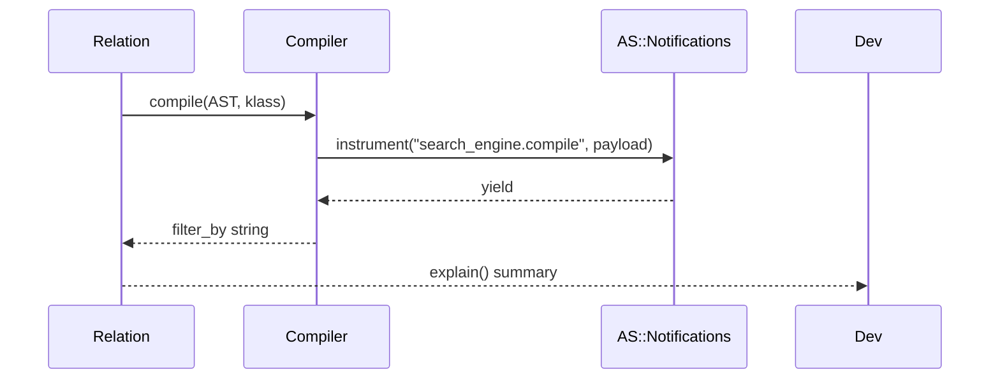

[← Back to Index](./index.md)

### Overview

Related: [DX](./dx.md), [Observability](./observability.md)

Add compile-time instrumentation and a developer-friendly introspection helper for relations.

- search_engine.compile: emitted around AST → Typesense params compilation.
- Relation#explain: prints a concise summary of chainers and compiled params without network calls.

### `search_engine.compile`

Emitted by `SearchEngine::Compiler.compile` for every AST compilation. Payload fields are minimal and redacted-safe:

- collection: Typesense collection name when resolvable, else nil
- klass: model class name when provided, else nil
- node_count: total AST node count compiled
- duration_ms: elapsed time in milliseconds (float)
- source: :ast

Subscribe example:

```ruby
ActiveSupport::Notifications.subscribe('search_engine.compile') do |*args|
  ev = ActiveSupport::Notifications::Event.new(*args)
  # ev.payload => { collection:, klass:, node_count:, duration_ms:, source: :ast }
end
```

See also: [Observability](./observability.md).

### `Relation#explain`

Summarizes the relation state by compiling params locally. No HTTP requests are performed.

- where: humanized `filter_by` with AND/OR/IN/NOT IN tokens
- order: joined `sort_by` (comma-separated)
- select: `include_fields`
- page/per: shows when present (supports `page/per` and `limit/offset` fallback)

Usage:

```ruby
rel = Product.all.where(active: true).where(brand_id: [1,2]).order(updated_at: :desc).page(2).per(20)
puts rel.explain
```

Sample output:

```text
SearchEngine::Product Relation
  where: active:=true AND brand_id IN [1, 2]
  order: updated_at:desc
  select: id,name
  page/per: 2/20
```

Options:

- to: :stdout — also prints the summary to STDOUT (default: return-only)

Caveats:

- Does not include secrets or full query bodies. `q` is not shown; API keys are never included.

### Compile timeline



Backlinks: [Relation](./relation.md) · [Compiler](./compiler.md) · [Observability](./observability.md)
