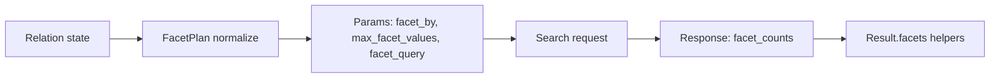

# Faceting

Faceting lets you present category-like distributions for fields alongside search results. This page describes the DSL, compiler mapping to Typesense params, and result helpers.

## DSL usage

Use chainable, immutable methods on `Relation`:

```ruby
rel = SearchEngine::Product
  .facet_by(:brand_id, max_values: 20)
  .facet_by(:category, sort: :count)
  .facet_query(:price, "[0..9]", label: "under_10")
```

Notes:
- `facet_by(field, max_values: nil)` adds a field to the facets list. If specified multiple times, fields are de‑duplicated by first occurrence.
- `facet_query(field, expr, label: nil)` adds a client‑labeled query bucket. Labels are attached client‑side in `Result#facets`.
- Relation stays immutable; each call returns a new instance.

## Compiler mapping

- Fields → `facet_by`: comma‑separated list in first‑mention order; duplicates removed.
- Caps → `max_facet_values`: Typesense supports a single global cap; we compile the maximum of requested per‑call caps.
- Queries → `facet_query`: compiled as a comma‑separated list of `"field:expr"` tokens.
- Sorting/statistics: not emitted. If provided, you’ll get a compile‑time error with a hint.



## Supported options

- `facet_by(field, max_values: nil)`: supports base fields only. Per‑field caps are normalized to a single `max_facet_values` by choosing the maximum request.
- `facet_query(field, expr, label: nil)`: basic validation for non‑empty strings and balanced range brackets (e.g., `"[0..9]"`).
- Unsupported: `sort`, `stats`. Attempting to use them raises with `docs/faceting.md#supported-options` anchor in the error.

## Result helpers

- `Result#facets` → `{ "brand_id" => [ { value:, count:, highlighted:, label: }, ... ] }`
- `Result#facet_values(name)` → array of value/count hashes for a field.
- `Result#facet_value_map(name)` → convenience `{ value => count }` hash.

Labels from `facet_query` are attached to buckets whose `value` exactly equals the declared expression.

## DX & explain

- `rel.dry_run!` and `rel.explain` include facet params preview: `facet_by`, `max_facet_values`, and `facet_query`.
- Observability redaction masks only sensitive values; facet params are left intact for clarity.

## Backlinks

- See `docs/relation_guide.md` for general DSL patterns.
- See `docs/dx.md` for dry‑run and explain helpers.
- See `docs/joins_selection_grouping.md` for grouping interactions.
- See `docs/field_selection.md` for attribute guardrails.
