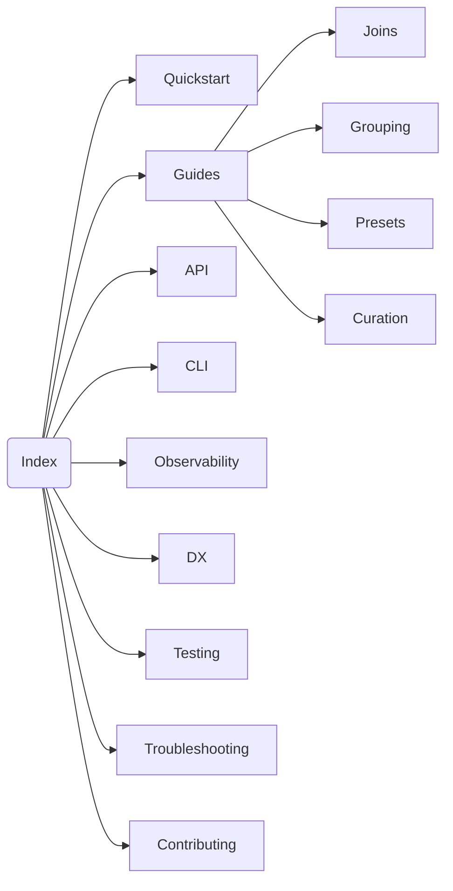

# Typesense Search Engine Docs

This portal helps you find core flows in ≤2 clicks. Start with Quickstart, then dive into Guides and API.

## Quickstart

- [Quickstart](./quickstart.md) — minimal setup and first query
- [Installation](./installation.md)
- [Configuration](./configuration.md)

## Guides

- [Relation](./relation.md)
- [Query DSL](./query_dsl.md)
- [Compiler](./compiler.md)
- [Field selection](./field_selection.md)
- [JOINs](./joins.md)
- [Grouping](./grouping.md)
- [Presets](./presets.md)
- [Curation](./curation.md)
- [Materializers](./materializers.md)

## API

- [Client](./client.md)
- [Relation](./relation.md)
- [Schema](./schema.md)
- [Indexer](./indexer.md)
- [Multi‑search](./multi_search.md)

## CLI

- [CLI](./cli.md) — `search_engine:doctor`, schema lifecycle, indexing

## Observability

- [Observability](./observability.md) — events, logging subscriber, OpenTelemetry

## DX

- [DX](./dx.md) — `explain`, `to_params_json`, `to_curl`, `dry_run!`
- [Debugging](./debugging.md)

## Testing

- [Testing](./testing.md) — stub client and event matchers

## Troubleshooting

- [Troubleshooting](./troubleshooting.md) — common errors and fixes

## Contributing

- [Docs style guide](./contributing/docs_style.md)
- Project overview: [README](../README.md)
