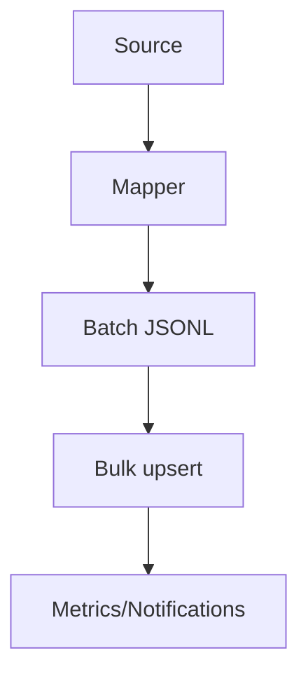

[← Back to Index](./index.md) · [Schema](./schema.md) · [Observability](./observability.md)

## Indexer

Stream documents into a physical collection via JSONL bulk import with retries, stable memory, and notifications.

### API

```ruby
SearchEngine::Indexer.import!(SearchEngine::Product, into: "products_20251001_010203_001", enum: enumerable_batches, batch_size: 2000)
```

- **into**: physical collection name
- **enum**: enumerable yielding batches (Arrays of Hash documents)
- **batch_size**: soft guard for JSONL production; batches are not re-sliced unless handling 413
- **action**: defaults to `:upsert`

### Data flow



### JSONL format

- One JSON object per line
- Newline between documents; trailing newline optional
- Strings are escaped by the JSON library

### Retries & backoff

- Transient errors (timeouts, connection, 429, 5xx) are retried with exponential backoff and jitter
- Non-transient errors (401/403/404/400/422) are not retried
- 413 Payload Too Large splits the batch recursively until it fits

### Memory notes

- Operates strictly batch-by-batch, reusing a single buffer
- No accumulation of all records in memory; per-batch array may be materialized to support 413 splitting

### Instrumentation

- Emits `search_engine.indexer.batch_import` per attempted batch
- Payload includes: `collection`, `batch_index`, `docs_count`, `success_count`, `failure_count`, `attempts`, `duration_ms`, `http_status`, `bytes_sent`, `transient_retry`, `error_sample`

### Dry-run

- `SearchEngine::Indexer.dry_run!(...)` builds JSONL for the first batch only and returns `{ collection, action, bytes_estimate, docs_count, sample_line }`

### FAQ

- **Do I need a mapper?** Not yet; provide Hash documents with at least an `id` field. A DSL may be introduced later.
- **Timeouts?** You can set `SearchEngine.config.indexer.timeout_ms` to override read timeout during import.

### Data Sources

Adapters provide batched records for the Indexer in a memory-stable way. Each adapter implements `each_batch(partition:, cursor:)` and yields arrays.

Examples:

```ruby
source :active_record, model: ::Product, scope: -> { where(active: true) }, batch_size: 2000
source :sql, sql: "SELECT * FROM products WHERE active = TRUE", fetch_size: 2000
source :lambda do |cursor: nil, partition: nil|
  Enumerator.new { |y| external_api.each_page(cursor) { |rows| y << rows } }
end
```

- `partition` and `cursor` are opaque; adapters interpret them per-domain (e.g., id ranges, keyset predicates, external API tokens).
- Instrumentation: emits `search_engine.source.batch_fetched` and `search_engine.source.error`.

Backlinks: [Schema](./schema.md), [Observability](./observability.md), [Client](./client.md)
