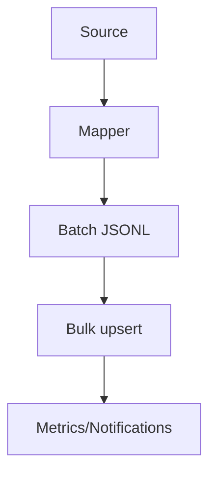
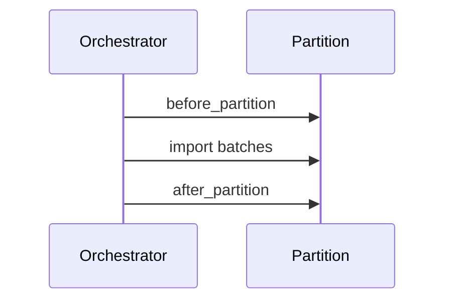

[← Back to Index](./index.md)

## Indexer

Related: [CLI](./cli.md), [Observability](./observability.md), [Troubleshooting → Indexer](./troubleshooting.md#indexer)

Stream documents into a physical collection via JSONL bulk import with retries, stable memory, and notifications.

### API

```ruby
SearchEngine::Indexer.import!(SearchEngine::Product, into: "products_20251001_010203_001", enum: enumerable_batches, batch_size: 2000)
```

- **into**: physical collection name
- **enum**: enumerable yielding batches (Arrays of Hash documents)
- **batch_size**: soft guard for JSONL production; batches are not re-sliced unless handling 413
- **action**: defaults to `:upsert`

### Data flow



### JSONL format

- One JSON object per line
- Newline between documents; trailing newline optional
- Strings are escaped by the JSON library

### Retries & backoff

- Transient errors (timeouts, connection, 429, 5xx) are retried with exponential backoff and jitter
- Non-transient errors (401/403/404/400/422) are not retried
- 413 Payload Too Large splits the batch recursively until it fits

### Memory notes

- Operates strictly batch-by-batch, reusing a single buffer
- No accumulation of all records in memory; per-batch array may be materialized to support 413 splitting

### Instrumentation

- Emits `search_engine.indexer.batch_import` per attempted batch
- Payload includes: `collection`, `batch_index`, `docs_count`, `success_count`, `failure_count`, `attempts`, `duration_ms`, `http_status`, `bytes_sent`, `transient_retry`, `error_sample`

### Dry-run

- `SearchEngine::Indexer.dry_run!(...)` builds JSONL for the first batch only and returns `{ collection, action, bytes_estimate, docs_count, sample_line }`

### Data Sources

Adapters provide batched records for the Indexer in a memory-stable way. Each adapter implements `each_batch(partition:, cursor:)` and yields arrays.

Examples:

```ruby
source :active_record, model: ::Product, scope: -> { where(active: true) }, batch_size: 2000
source :sql, sql: "SELECT * FROM products WHERE active = TRUE", fetch_size: 2000
source :lambda do |cursor: nil, partition: nil|
  Enumerator.new { |y| external_api.each_page(cursor) { |rows| y << rows } }
end
```

- `partition` and `cursor` are opaque; adapters interpret them per-domain (e.g., id ranges, keyset predicates, external API tokens).
- Instrumentation: emits `search_engine.source.batch_fetched` and `search_engine.source.error`.

### Mapper

Backlinks: [Sources](./indexer.md#data-sources), [Schema](./schema.md)

```ruby
class SearchEngine::Product < SearchEngine::Base
  collection "products"
  attribute :id, :integer
  attribute :shop_id, :integer
  attribute :brand_id, :integer
  attribute :brand_name, :string
  attribute :price_cents, :integer

  index do
    source :active_record, model: ::Product, scope: -> { where(active: true) }
    map do |r|
      { id: r.id, shop_id: r.shop_id, brand_id: r.brand_id, brand_name: r.brand&.name, price_cents: r.price_cents }
    end
  end
end
```

Model → Document mapping:

| Model field | Document field | Transform |
| --- | --- | --- |
| `id` | `id` | identity |
| `shop_id` | `shop_id` | identity |
| `brand_id` | `brand_id` | identity |
| `brand.name` | `brand_name` | rename + safe navigation |
| `price_cents` | `price_cents` | identity |

Validation:

- Missing required fields: errors like `Missing required fields: [:id, :title] for SearchEngine::Product mapper.`
- Unknown fields: warns by default; set `SearchEngine.config.mapper.strict_unknown_keys = true` to error.
- Type checks: invalid types reported (e.g., `Invalid type for field :price_cents (expected Integer, got String: "12.3").`).
- Coercions: enable with `SearchEngine.config.mapper.coercions[:enabled] = true` (safe integer/float/bool only).

Runtime API:

- `mapper = SearchEngine::Mapper.for(SearchEngine::Product)`
- `docs, report = mapper.map_batch!(rows, batch_index: 1)`
- Emits `search_engine.mapper.batch_mapped` per batch with: `collection`, `batch_index`, `docs_count`, `duration_ms`, `missing_required_count`, `extra_keys_count`, `invalid_type_count`, `coerced_count`.

### Partitioning

Backlinks: [Index](./index.md), [Sources](./indexer.md#data-sources), [Mapper](./indexer.md#mapper)

```ruby
index do
  partitions { Shop.pluck(:id) }
  partition_fetch { |shop_id| ::Product.where(shop_id: shop_id).in_batches(of: 2000) }
  before_partition { |shop_id| delete_by filter_by: "shop_id:=#{shop_id}" }
  after_partition  { |shop_id| # custom metrics }
end
```

```ruby
SearchEngine::Indexer.rebuild_partition!(SearchEngine::Product, partition: shop_id)
```



Notes:
- `partitions` must return an Enumerable of keys; `partition_fetch` must return an Enumerable of batches (Arrays of records).
- Hooks are optional; if provided, they must accept exactly one argument (the partition key).
- When `partition_fetch` is missing, the source adapter is used with the partition passed through; for ActiveRecord sources, provide a `Hash`/`Range` partition or define `partition_fetch`.

### Stale Deletes

Backlinks: [Index](./index.md), [Partitioning](./indexer.md#partitioning), [Dispatcher](./indexer.md#dispatcher), [CLI](./cli.md)

```ruby
class SearchEngine::Product < SearchEngine::Base
  stale_filter_by do |partition: nil|
    partition ? "shop_id:=#{partition} && archived:=true" : "archived:=true"
  end
end
```

```ruby
SearchEngine::Indexer.delete_stale!(SearchEngine::Product, partition: nil)
```

- Produces a `filter_by` string from your block and issues a `DELETE /collections/:collection/documents` with `filter_by`.
- If the block returns `nil` or an empty String, deletion is skipped.
- Strict-mode guardrails block suspicious catch-alls; enable via `SearchEngine.config.stale_deletes.strict_mode = true`.
- Dry-run preview: `SearchEngine::Indexer.delete_stale!(SearchEngine::Product, partition: shop_id, dry_run: true)` returns a summary without deleting.

Typical filters:

| Pattern | Example |
| --- | --- |
| Archived flag | `archived:=true` |
| Partition + archived | `shop_id:=123 && archived:=true` |
| Date threshold | `updated_at:<"2025-01-01T00:00:00Z"` |


Events:
- `search_engine.stale_deletes.started` — `{ collection, into, partition, filter_hash }`
- `search_engine.stale_deletes.skipped` — `{ reason, collection, into, partition }`
- `search_engine.stale_deletes.finished` — `{ collection, into, partition, duration_ms, deleted_count }`
- `search_engine.stale_deletes.error` — `{ collection, into, partition, error_class, message_truncated }`

Config:
- `SearchEngine.config.stale_deletes.enabled = true`
- `SearchEngine.config.stale_deletes.strict_mode = false`
- `SearchEngine.config.stale_deletes.timeout_ms = nil`
- `SearchEngine.config.stale_deletes.estimation_enabled = false`

### Dispatcher

Backlinks: [Index](./index.md), [Partitioning](./indexer.md#partitioning), [Mapper](./indexer.md#mapper), [CLI](./cli.md)

```ruby
SearchEngine.configure do |c|
  c.indexer.dispatch = :active_job # or :inline
  c.indexer.queue_name = "search_index"
end
```

- **What it does:** routes per-partition rebuilds either synchronously (inline) or via `ActiveJob`.
- **API:** `SearchEngine::Dispatcher.dispatch!(SearchEngine::Product, partition: key, into: nil, mode: nil, queue: nil, metadata: {})`
  - Returns an object describing the action: for ActiveJob `{ mode: :active_job, job_id, queue, collection, partition, into }`; for inline `{ mode: :inline, collection, partition, into, indexer_summary, duration_ms }`.
- **Mode resolution:** `mode || SearchEngine.config.indexer.dispatch` with a fallback to `:inline` if ActiveJob is unavailable.
- **Queue name:** taken from `queue || SearchEngine.config.indexer.queue_name`.

ActiveJob job: `SearchEngine::IndexPartitionJob`.

- **Args:** `collection_class_name` (String), `partition` (JSON-serializable), optional `into` (String), optional `metadata` (Hash).

## Troubleshooting

- **Bulk import shape errors**: Ensure each document is a flat Hash with required keys and valid types.
- **Retry exhaustion**: Inspect `search_engine.indexer.batch_import` events; increase backoff or fix upstream issues.
- **Stale deletes strict block**: Verify your filter is not a catch-all; use partition guards.

Backlinks: [README](../README.md), [Schema](./schema.md)
