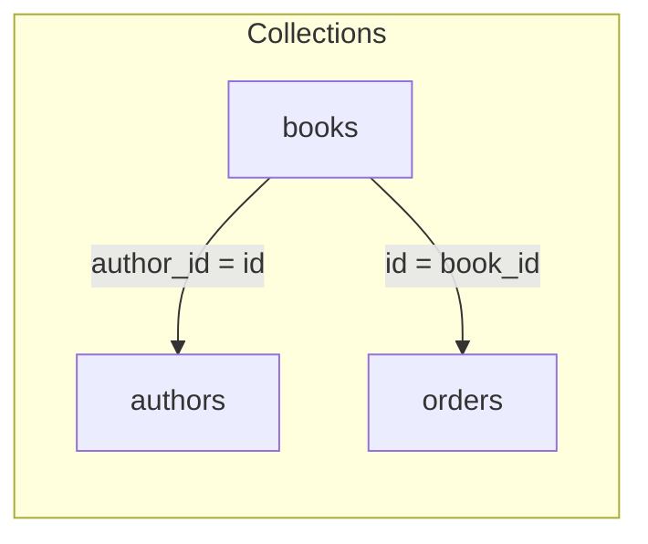

[← Back to Index](./index.md)

# Join Declarations on Base

Related: [Observability](./observability.md), [Field selection](./field_selection.md), [Troubleshooting → Joins](./troubleshooting.md#joins)

Server‑side joins require lightweight association metadata declared on your model class. This page documents the model‑level DSL, the per‑class registry, how the relation compiles joined selections/filters/sorts, and the instrumentation emitted during compile.

## Overview

- **Declare** associations on your model with `join :name, collection:, local_key:, foreign_key:`.
- **Select** joins in queries with `Relation#joins(*assocs)`; names validated against the model’s registry.
- **Use** nested include fields for joined collections; `where`/`order` can target joined fields using `$assoc.field`.
- **Observe** compile‑time summaries via `search_engine.joins.compile` without exposing raw literals.

```mermaid
flowchart LR
  subgraph Relation state
    A[.joins(:authors)] --> B[select_nested (include_fields)]
    A --> C[ast (where)]
    A --> D[orders]
  end
  B & C & D --> E[Compiler]
  E --> F[include_fields/filter_by/sort_by]
  E --> G[_join context]
```

## DSL

Declare joinable associations on your model using `join`:

```ruby
class SearchEngine::Book < SearchEngine::Base
  collection "books"
  attribute :id, :integer
  attribute :author_id, :integer

  join :authors, collection: "authors", local_key: :author_id, foreign_key: :id
  join :orders,  collection: "orders",  local_key: :id,        foreign_key: :book_id
end
```

- `name` (Symbol): logical association name.
- `collection` (String): target Typesense collection name.
- `local_key` (Symbol): local attribute used as the join key.
- `foreign_key` (Symbol): foreign key in the target collection.

## Registry and Read APIs

- `joins_config` returns a frozen mapping `{ name(Symbol) => JoinConfig(Hash) }`.
- `join_for(name)` returns a single normalized config or raises `SearchEngine::Errors::UnknownJoin` with suggestions.

The registry is per‑class, immutable to callers, and uses copy‑on‑write for safe updates. Subclasses inherit parent declarations and may add new ones; duplicate names raise.

## Relation Usage

Use `Relation#joins(*assocs)` to select join associations on a query. Names are validated against the model’s `joins_config` and stored in the relation’s immutable state in the order provided. Multiple calls append:

```ruby
SearchEngine::Book
  .joins(:authors, :orders)
  .where(authors: { last_name: "Rowling" })
  .where(orders: { total_price: 12.34 })
  .order(authors: { last_name: :asc })
```

```mermaid
flowchart LR
  R[Relation] -- joins(:authors) --> S[State joins=[authors]]
  S -- joins(:orders) --> S2[joins=[authors, orders]]
```

- `joins` accepts symbols/strings; inputs are normalized to symbols.
- Unknown names raise `SearchEngine::Errors::UnknownJoin` with an actionable message that lists available associations.
- Order is preserved and duplicates are not deduped by default; explicit chaining is honored.
- For debugging, `rel.joins_list` returns the frozen array of association names in state.

Backlinks: [← Back to Index](./index.md) · [Relation](./relation.md) · [Compiler](./compiler.md) · [Observability](./observability.md#observability) · [Field Selection](./field_selection.md)

## Filtering and Ordering on Joined Fields

With joins applied, you can reference joined collection fields in `where` and `order` using nested hashes. Joined left‑hand‑sides render as `$assoc.field`.

| Input (Ruby) | Compiled filter_by | Compiled sort_by |
| --- | --- | --- |
| `where(authors: { last_name: "Rowling" })` | `$authors.last_name:="Rowling"` | – |
| `where(orders: { total_price: 12.34 })` | `$orders.total_price:=12.34` | – |
| `order(authors: { last_name: :asc })` | – | `$authors.last_name:asc` |
| `order("$authors.last_name:asc")` | – | `$authors.last_name:asc` |

Notes:
- Base fields continue to work unchanged (e.g., `where(active: true)`).
- Mixed base and joined predicates interleave as usual; the compiler preserves grouping semantics.
- Raw `order` strings are accepted as‑is; ensure you supply valid Typesense fragments.

### AST Path Diagram

The parser produces a normal predicate node with a joined field path for the LHS. The compiler renders it verbatim.

```mermaid
flowchart TD
  A[Hash input] -->|{ authors: { last_name: "Rowling" } }| P[Parser]
  P -->|LHS "$authors.last_name"| N[AST::Eq]
  N --> C[Compiler]
  C -->|filter_by| F[$authors.last_name:="Rowling"]
```

## Association Table Pattern

Render declared joins for a model to reason about relationships:

| Name    | Target collection | Local key   | Foreign key | Notes |
|---------|-------------------|-------------|-------------|-------|
| authors | authors           | author_id   | id          | one‑to‑many by author_id |
| orders  | orders            | id          | book_id     | order items linked to book |

## Mermaid Overview



## Guardrails & errors

Backlinks: [← Back to Index](./index.md) · [Relation](./relation.md) · [Compiler](./compiler.md)

Misuse scenarios are validated early with actionable errors and suggestions:

- Unknown association on model → `SearchEngine::Errors::InvalidJoin` with guidance and suggestions.
- Incomplete join config (missing `local_key`/`foreign_key`) → `SearchEngine::Errors::InvalidJoinConfig`.
- Using joined fields without calling `.joins(:assoc)` → `SearchEngine::Errors::JoinNotApplied`.
- Unknown field within the joined collection → `SearchEngine::Errors::UnknownJoinField` (best‑effort; skipped if target model is unavailable).
- Multi‑hop paths (e.g. `$authors.publisher.name`) → `SearchEngine::Errors::UnsupportedJoinNesting`.
- Duplicate selections/orders are deduped; first mention wins.

### Troubleshooting

- **Unknown association**: Declare it on the model via `join :name, collection:, local_key:, foreign_key:`.
- **Join not applied**: Chain `.joins(:assoc)` before filtering/sorting/selecting nested fields.
- **Unknown joined field**: Verify the target collection’s attributes and spelling; suggestions may be provided.
- **Multi‑hop path**: Only `$assoc.field` is supported. Denormalize deeper paths first.

Backlinks: [README](../README.md), [Field Selection](./field_selection.md)

## Nested field selection for joined collections

Backlinks: [← Back to Index](./index.md) · [Relation](./relation.md) · [Field Selection](./field_selection.md)

You can select fields from joined collections using a nested Ruby shape. These compile to Typesense `include_fields` with `$assoc(field,...)` segments.

```ruby
# Full relation example
SearchEngine::Book
  .joins(:authors)
  .include_fields(:id, :title, authors: [:first_name, :last_name])
```

Compiles to:

```
$authors(first_name,last_name),id,title
```

- **Input types**: mix base fields (`:id, "title"`) and nested hashes (`authors: [:first_name, :last_name]`).
- **Merging**: multiple calls merge and dedupe. First mention wins ordering; later calls append only new fields.

```ruby
# Merged across calls
SearchEngine::Book
  .include_fields(:id, authors: [:a])
  .include_fields(:title, authors: [:b, :a])
# => "$authors(a,b),id,title"
```

- **Ordering policy**: nested `$assoc(...)` segments are emitted first in association first-mention order, then base fields.
- **Validation**: association keys are validated against `klass.joins_config` (`UnknownJoin` on typos). Calling `.joins(:assoc)` before selecting nested fields is recommended; the compiler will still emit `$assoc(...)` even if `joins` wasn't chained yet.

### End-to-end example with filters and sort

```ruby
rel = SearchEngine::Book
  .joins(:authors)
  .include_fields(authors: [:first_name])
  .where(authors: { last_name: "Rowling" })
  .order(authors: { last_name: :asc })
rel.to_typesense_params
# => { q: "*", query_by: "name, description", include_fields: "$authors(first_name)", filter_by: "$authors.last_name:="Rowling"", sort_by: "$authors.last_name:asc" }
```

Internals: the returned params also include a reserved `:_join` key with join context for downstream components. See [Compiler](./compiler.md) for the exact shape.

See also: [Compiler](./compiler.md).

---

## Instrumentation

Backlinks: [Observability](./observability.md) · [Compiler](./compiler.md)

A compile‑time event is emitted per relation compile to summarize JOIN usage.

- **Event**: `search_engine.joins.compile`
- **Payload keys** (nil/empty omitted):
  - `collection` — fully‑qualified class name (e.g., `SearchEngine::Book`)
  - `join_count` — integer number of associations referenced
  - `assocs` — ordered short array of association names
  - `used_in` — `{ include: [...], filter: [...], sort: [...] }` with association names
  - `include_len` — character length of compiled include string
  - `filter_len` — length of `filter_by`
  - `sort_len` — length of `sort_by`
  - `duration_ms` — compile duration
  - `has_joins` — boolean

No raw filters or string literal values are included.

### Sample logs

KV format:

```
event=joins.compile collection=SearchEngine::Book joins.assocs=authors,orders joins.count=2 joins.used_in=include:authors|filter:authors|sort:authors joins.include.len=24 joins.filter.len=42 joins.sort.len=16 has_joins=true duration.ms=0.8
```

JSON format:

```json
{"event":"joins.compile","collection":"SearchEngine::Book","joins.assocs":"authors,orders","joins.count":2,"joins.used_in":"include:authors|filter:authors|sort:authors","joins.include.len":24,"joins.filter.len":42,"joins.sort.len":16,"has_joins":true,"duration.ms":0.8}
```
