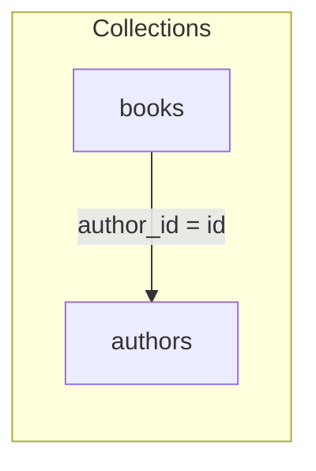

[← Back to Index](./index.md)

# Joins, field selection, and grouping — deep‑dive

Use JOINs to enrich a base collection with associated data, apply nested field selection to
control payload size, and group results to present one or a few representatives per key. This
page ties them together with a single running example and calls out guardrails, DX tools,
and performance implications.

## Overview

- Use JOINs + nested selection for author pages, listings with badges, and catalogs where
  denormalized snippets from related entities improve recall/UX
- Add grouping to show a single representative per logical key (e.g., one book per author,
  one variant per product)
- Trade‑offs:
  - Payload size vs clarity: include only fields you render; nested selection reduces bloat
  - Grouping changes pagination semantics (per_page applies to groups, not hits)
  - Sorting applies before grouping; within‑group order follows backend order

Running example (verbatim; used throughout):

```ruby
SearchEngine::Book
  .joins(:authors)
  .include_fields(:id, :title, authors: [:first_name, :last_name])
  .where(authors: { last_name: "Rowling" })
  .group_by(:author_id, limit: 1)
```

## Association DSL & `joins`

- Declare associations on the model: `join :authors, collection: "authors", local_key: :author_id,
  foreign_key: :id`
- Select associations on the relation with `joins(:association)`; names are validated against
  the model registry
- Nested associations: only single‑hop paths are supported (`$assoc.field`); multi‑hop is not
  supported
- Join keys are explicit (no inference): `local_key` on the base model maps to `foreign_key` in
  the target collection
- Supported join usage: selection, filtering, and ordering on joined fields; grouping must target
  base fields only

See [Joins → DSL](./joins.md#dsl) and
[Filtering and ordering](./joins.md#filtering-and-ordering-on-joined-fields) for details.

## Nested field selection with `include_fields`

Use a nested Ruby shape to select fields from joined entities. This compiles to Typesense
`include_fields` with `$assoc(field,...)` segments.

- Reduces payload size and hydration work
- Keeps templates/view models explicit about data they require
- Unknown fields trigger guardrails with suggestions

Example (verbatim; same relation as above):

```ruby
SearchEngine::Book
  .joins(:authors)
  .include_fields(:id, :title, authors: [:first_name, :last_name])
  .where(authors: { last_name: "Rowling" })
  .group_by(:author_id, limit: 1)
```

Notes:
- Multiple `include_fields` calls merge and dedupe; first mention preserves order
- Excludes win when present; effective selection is `include − exclude` per path
- Guardrails: unknown association → `InvalidJoin`; unknown nested field → `UnknownJoinField`
  with “did you mean …” hints

See: [Field selection](./field_selection.md),
[Field selection → Guardrails](./field_selection.md#guardrails--errors).

## Filtering & ordering on joined fields

- Filters: `where(authors: { last_name: "Rowling" })` → `$authors.last_name:="Rowling"`
- Sorts: `order(authors: { last_name: :asc })` → `$authors.last_name:asc`
- Quoting and reserved characters are handled by the sanitizer; booleans become `true/false`,
  `nil` becomes `null`
- Schema expectations: joined fields must exist in the target collection; base fields continue to
  work unchanged

See: [Joins](./joins.md#filtering-and-ordering-on-joined-fields),
[Query DSL](./query_dsl.md), and [Compiler](./compiler.md#integration).

## Grouping semantics & `groups` API

`group_by(:field, limit:, missing_values:)` groups results and caps hits per group. Group order and
within‑group order are preserved as returned by the backend. Sorting is applied before grouping,
so it influences which hits become representatives within each group.

- Syntax: `.group_by(:author_id, limit: 1)`
- Difference between grouping order and result order:
  - Group order is preserved in `Result#groups`
  - `Result#hits` / `to_a` return the first hit per group (representatives) in group order
  - Changing `order(...)` changes which hit is the representative, not the group order
- Access API:

```ruby
res = SearchEngine::Book.joins(:authors)
       .group_by(:author_id, limit: 2)
       .execute

res.grouped?           #=> true
res.groups_count       #=> number of groups on this page
res.total_groups       #=> global groups when exposed by backend, else groups_count

res.groups.each do |group|
  group.key    #=> { "author_id" => 123 }
  group.hits   #=> [<Book ...>, <Book ...>] # hydrated in backend order
end

res.to_a               #=> [first_hit_per_group, ...]
```

Caveats:
- Grouping supports base fields only; joined paths like `$authors.last_name` are rejected
- Large `group_limit` can increase memory use during hydration

See: [Grouping](./grouping.md#working-with-groups),
[Grouping → Guardrails](./grouping.md#guardrails--errors).

## Guardrails & errors

Common issues and actionable hints (messages are redaction‑safe and include doc anchors; errors
respond to `#to_h` for structured logging):

- Unknown association (e.g., `joins(:authrs)`): raises `InvalidJoin`
  - Hint: “Declare it via `join :authors, ...` or check spelling”
  - See: [Joins → Guardrails](./joins.md#guardrails--errors)
- Join not applied (filter/order/select on joined fields without `.joins(:authors)`): raises
  `JoinNotApplied`
  - Hint: “Call `.joins(:authors)` before filtering/sorting/selecting nested fields”
  - See: [Joins → Troubleshooting](./joins.md#troubleshooting)
- Unknown joined field (e.g., `authors: [:middle_name]`): raises `UnknownJoinField`
  - Hint: “Did you mean `:first_name`?” (suggestions provided)
  - See: [Field selection → Guardrails](./field_selection.md#guardrails--errors)
- Invalid grouping limit (e.g., `limit: 0`): raises `InvalidGroup`
  - Hint: “Provide a positive integer; omit to use server default”
  - See: [Grouping → Validation](./grouping.md#validation)
- Non‑boolean `missing_values` (e.g., `"yes"`): raises `InvalidGroup`
  - Hint: “Use `true`/`false`; `nil` omits the parameter”
  - See: [Grouping → Guardrails](./grouping.md#guardrails--errors)
- Grouping on joined path (e.g., `$authors.last_name`): raises `UnsupportedGroupField`
  - Hint: “Group by a base field (e.g., `:author_id`)”
  - See: [Grouping → Troubleshooting](./grouping.md#troubleshooting)
- “Conflicting” order with grouping (surprising results): compiles, but remember sort is applied
  before grouping; it selects the representatives, not the group order
  - Hint: “Adjust sort to pick desired representatives; group order is preserved”
  - See: [Grouping → Gotchas](./grouping.md#gotchas)

## Debugging & DX

Inspect without network I/O; all outputs are redacted and copy‑pastable.

```ruby
rel = SearchEngine::Book
        .joins(:authors)
        .include_fields(:id, :title, authors: [:first_name, :last_name])
        .where(authors: { last_name: "Rowling" })
        .group_by(:author_id, limit: 1)

rel.explain           # concise summary (grouping, joins, selection, order)
rel.dry_run!          # => { url:, body:, url_opts: } (no HTTP)
rel.to_curl           # single‑line curl (see DX for context)
```

Offline tests: enable the stub client and queue responses to exercise relations end‑to‑end with
no external calls. See [Testing → Quick start](./testing.md#quick-start).

See also: [DX helpers](./dx.md#helpers--examples), [Observability → Logging](./observability.md#logging).

## Multi‑diagram story

### Association map (Book ↔ Author)



### State → Params mapping (running example)

```mermaid
flowchart LR
  subgraph R[Relation state]
    J[joins(:authors)]
    S[include_fields(:id,:title, authors: [:first_name,:last_name])]
    W[where(authors: { last_name: "Rowling" })]
    G[group_by(:author_id, limit: 1)]
  end
  R --> C[Compiler]
  C --> P[Typesense params
  { include_fields: "$authors(...)",
    filter_by: "$authors.last_name:=\"Rowling\"",
    group_by: "author_id",
    group_limit: 1 }]
```

### Grouped response shaping (representatives per author)

```mermaid
flowchart TD
  A[Typesense grouped response] -->|grouped_hits| B[Result shaping]
  B --> C[Groups (Result::Group[])]
  C --> D[Representative hits (to_a/hits)]
  C --> E[Per-group hits (group.hits)]
```

## Performance notes

- Prefer minimal nested `include_fields` to avoid payload bloat and faster hydration
- Grouping affects pagination: `per_page` applies to number of groups; `group_limit` caps hits
  per group
- Sorting before grouping determines representatives; be explicit about sort fields and
  directions
- Use compact logging with sampling to diagnose: `SearchEngine.configure do |c|
  c.logging = OpenStruct.new(mode: :compact, sample: 1.0) end`
  - See [Observability](./observability.md) for payload redaction and event payloads

---

Related links: [Relation guide](./relation_guide.md), [Query DSL](./query_dsl.md),
[Compiler](./compiler.md), [Grouping](./grouping.md), [Joins](./joins.md),
[Field selection](./field_selection.md), [DX](./dx.md), [Observability](./observability.md),
[Curation](./curation.md), [Presets](./presets.md)
