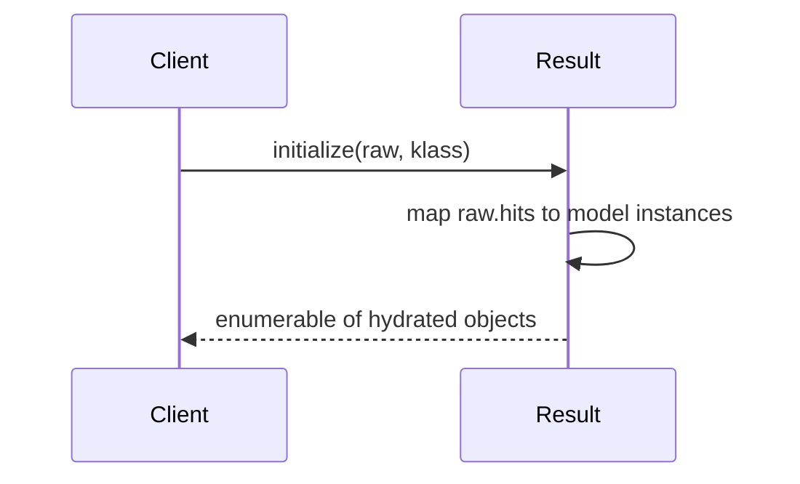

[← Back to Index](./index.md)

[Client](./client.md) · [Models](./models.md)

## Result materialization and hydration

`SearchEngine::Result` wraps the raw Typesense response and hydrates each hit into a Ruby object. When a model class is known for the collection, hydrated hits are instances of that class; otherwise, a plain `OpenStruct` is used.

### Why

- Normalize access to metadata: `found`, `out_of`, `facets`, and `raw`.
- Provide `Enumerable` over hydrated hits.
- Respect field selection (`include_fields`) by hydrating only keys present in the returned document.

### Hydration flow



### API

- `Result#found` → number of matching documents
- `Result#out_of` → number of documents searched
- `Result#facets` → facet counts (if present)
- `Result#raw` → original parsed response (Hash)
- `Enumerable` → iterate hydrated results (`each`, `map`, ...)
- `to_a` → duplicate Array of hydrated hits; internal array is frozen
- `size`, `empty?`

### Hydration rules

- If a model class is provided, each hit document is assigned to an instance of that class via instance variables named after the document keys. Unknown keys are permitted.
- If no class is provided or collection is unknown, an `OpenStruct` is created per hit.
- Selection is respected implicitly: only keys present in the returned document are set. Missing attributes are not synthesized.

### Examples

```ruby
client = SearchEngine::Client.new
result = client.search(collection: "products", params: { q: "milk", query_by: "name" })
result.found  # => 10
result.out_of # => 1000

result.each do |obj|
  # obj is SearchEngine::Product if the collection is registered,
  # otherwise an OpenStruct with the document keys.
end

result.to_a # => [#<SearchEngine::Product ...>, ...]
```

Tip: When using Typesense `include_fields`, only included fields will be hydrated on each object.
