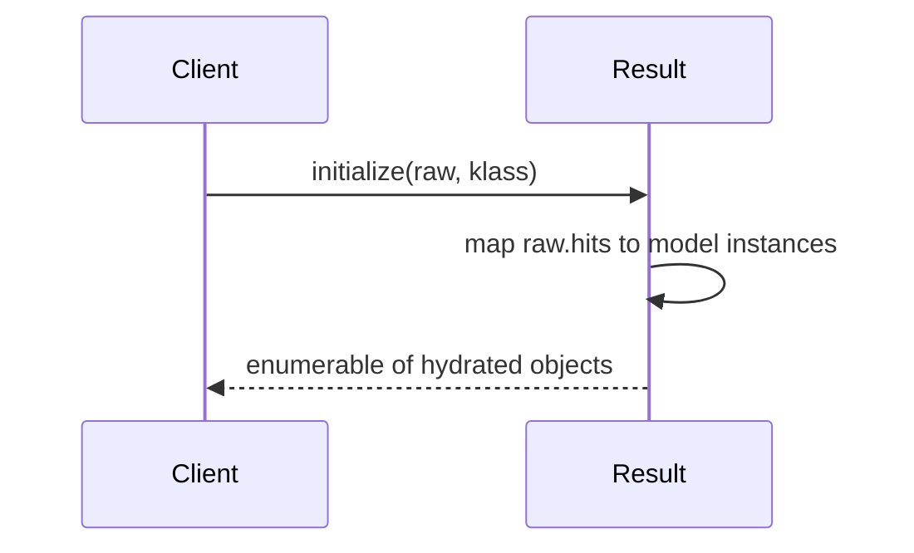
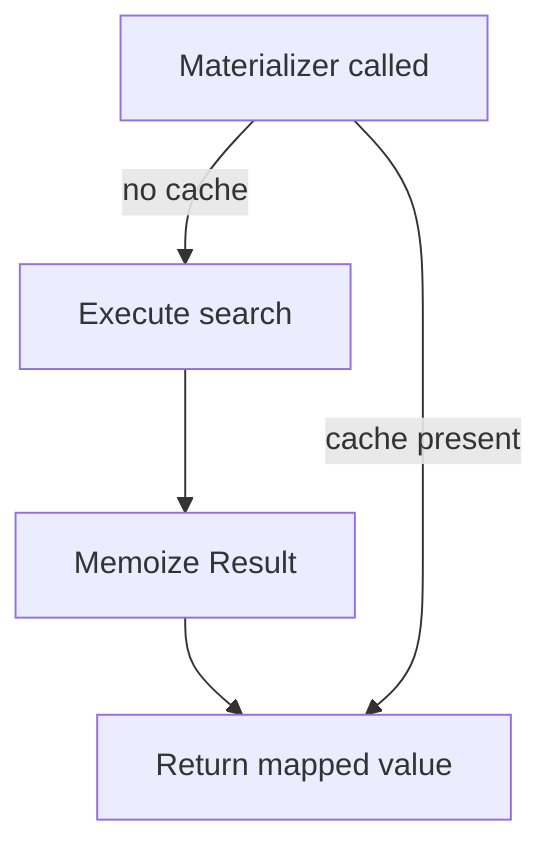
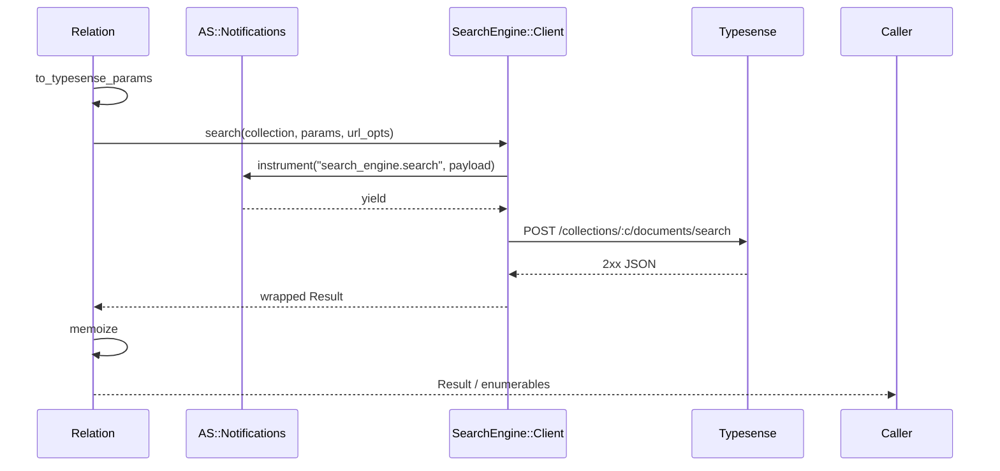

[← Back to Index](./index.md)

[Client](./client.md) · [Relation](./relation.md) · [Observability](./observability.md)

## Result materialization and hydration

`SearchEngine::Result` wraps the raw Typesense response and hydrates each hit into a Ruby object. When a model class is known for the collection, hydrated hits are instances of that class; otherwise, a plain `OpenStruct` is used.

### Why

- Normalize access to metadata: `found`, `out_of`, `facets`, and `raw`.
- Provide `Enumerable` over hydrated hits.
- Respect field selection (`include_fields`) by hydrating only keys present in the returned document.

### Hydration flow



### API

- `Result#found` → number of matching documents
- `Result#out_of` → number of documents searched
- `Result#facets` → facet counts (if present)
- `Result#raw` → original parsed response (Hash)
- `Enumerable` → iterate hydrated results (`each`, `map`, ...)
- `to_a` → duplicate Array of hydrated hits; internal array is frozen
- `size`, `empty?`

### Hydration rules

- If a model class is provided, each hit document is assigned to an instance of that class via instance variables named after the document keys. Unknown keys are permitted.
- If no class is provided or collection is unknown, an `OpenStruct` is created per hit.
- Selection is respected implicitly: only keys present in the returned document are set. Missing attributes are not synthesized.

### Examples

```ruby
client = SearchEngine::Client.new
result = client.search(collection: "products", params: { q: "milk", query_by: "name" })
result.found  # => 10
result.out_of # => 1000

result.each do |obj|
  # obj is SearchEngine::Product if the collection is registered,
  # otherwise an OpenStruct with the document keys.
end

result.to_a # => [#<SearchEngine::Product ...>, ...]
```

Tip: When using Typesense `include_fields`, only included fields will be hydrated on each object.

---

## Pluck & selection

`pluck(*fields)` validates requested fields against the effective selection (include − exclude; exclude wins) before executing. When a requested field is not permitted, it fails fast with an actionable error.

Example:

```ruby
SearchEngine::Product.select(:id).pluck(:name)
# raises InvalidSelection: field :name not in effective selection. Use `reselect(:id,:name)`.
```

Hints:
- When a field is explicitly excluded, the error suggests removing the exclude.
- When includes are present but missing the field, the error suggests `reselect(...)` with the current includes plus the requested fields.

`ids` delegates to `pluck(:id)`. It succeeds when `:id` is permitted by the effective selection. If `:id` is explicitly excluded or not part of an include list (when includes are present), it raises `InvalidSelection` and suggests how to fix it. When includes are empty, all fields are allowed except explicit excludes, so `ids` works by default.

See also: [Field Selection DSL](./field_selection.md).

---

## Relation materializers and single-request memoization

Materializers on `SearchEngine::Relation` trigger execution and cache a single `SearchEngine::Result` per relation instance. The first materializer issues exactly one search; subsequent materializers reuse the cached result. Relation immutability is preserved: chainers return new relations; materializers only populate an internal memo that is invisible to `inspect` and equality.



### API

- `to_a` → triggers fetch and memoizes; returns hydrated hits
- `each` → enumerates hydrated hits
- `first(n = nil)` → from the loaded page; `n` optional
- `last(n = nil)` → from the loaded page tail; no extra HTTP
- `take(n = 1)` → head items; when `n == 1` returns a single object
- `pluck(*fields)` → for one field returns a flat array; for many returns array-of-arrays. Falls back to raw documents when model readers are absent
- `ids` → convenience for `pluck(:id)`
- `count` → if loaded, uses memoized `found`; otherwise performs a minimal request
- `exists?` → if loaded, uses memoized `found`; otherwise performs a minimal request

Concurrency: first load is synchronized across threads; subsequent materializer calls reuse the memo without locking.

### Minimal request for `count` / `exists?`

When the relation has no memo yet, `count`/`exists?` issue a minimal search using the same compiled filters/sort and query defaults, but forcing:

- `per_page = 1`, `page = 1`
- `include_fields = "id"`

The response’s `found` is returned and no full `Result` is memoized.

### Examples

```ruby
rel = SearchEngine::Product.where(active: true).limit(10)
rel.to_a         # triggers fetch and memoizes
rel.count        # uses memoized found
rel.ids          # plucks id from cached hits
rel.pluck(:name) # plucks a single field
```

Callouts:

- `last` operates on the currently fetched page. For dataset tail, use explicit sorting/pagination.
- `pluck` prefers model readers when available, otherwise reads raw documents for robustness.
- `count`/`exists?` perform a minimal request only when there is no memo; once loaded, they reuse the cached `found`.

---

## Execution & memoization

Materializers call into relation execution, which compiles Typesense body params, merges URL-level cache knobs (config defaults with optional relation overrides), and performs a single client call per relation instance. The raw response is wrapped as `SearchEngine::Result` and memoized for reuse.



- **URL options**: `{ use_cache, cache_ttl }` originate from `SearchEngine.config` and may be overridden per relation via `relation.options(use_cache: ..., cache_ttl: ...)`.
- **Redaction**: Event payload params are redacted via `SearchEngine::Observability.redact`.

See also: [Observability](./observability.md) and [Client](./client.md).
