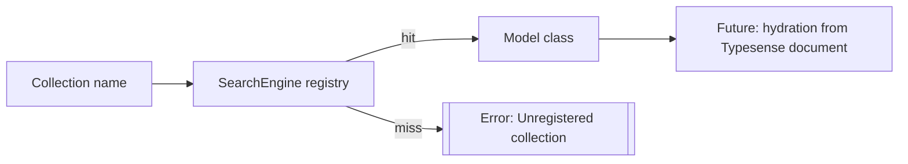

[← Back to Index](./index.md)

Related: [Client](./client.md), [Materializers](./materializers.md)

## Models and the Collection Registry

**SearchEngine** provides a minimal model layer to prepare for future hydration of Typesense documents into Ruby objects. A thread-safe registry maps Typesense collection names to model classes.

- **Registry**: `SearchEngine.register_collection!(name, klass)` and `SearchEngine.collection_for(name)`
- **Base class**: `SearchEngine::Base` with `collection` and `attribute` macros

### Declare a model

```ruby
class SearchEngine::Product < SearchEngine::Base
  collection "products"
  attribute :id,   :integer
  attribute :name, :string
end
```

### Lookup

```ruby
SearchEngine.collection_for("products")
#=> SearchEngine::Product
```

### Errors

- Unknown collection: raises `ArgumentError` with a helpful message
- Duplicate registration: re-registering the same mapping is a no‑op; attempting to map a collection to a different class raises `ArgumentError`

### Inheritance

Attributes declared in a parent class are inherited by subclasses. A subclass may override an attribute by redeclaring it:

```ruby
class SearchEngine::Item < SearchEngine::Base
  attribute :name, :string
end

class SearchEngine::Book < SearchEngine::Item
  attribute :name, :text # overrides only for Book
end
```

### Flow (registry lookup)



See also: [Client](./client.md).

### Thread-safety and reload-friendliness

The collection registry uses a copy-on-write Hash guarded by a small Mutex. Reads are lock-free and writes are atomic, which makes it safe under concurrency and friendly to Rails code reloading in development.

See also: [Index](./index.md).
