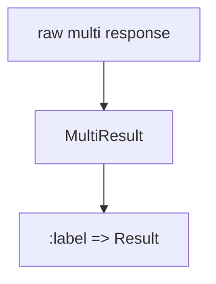
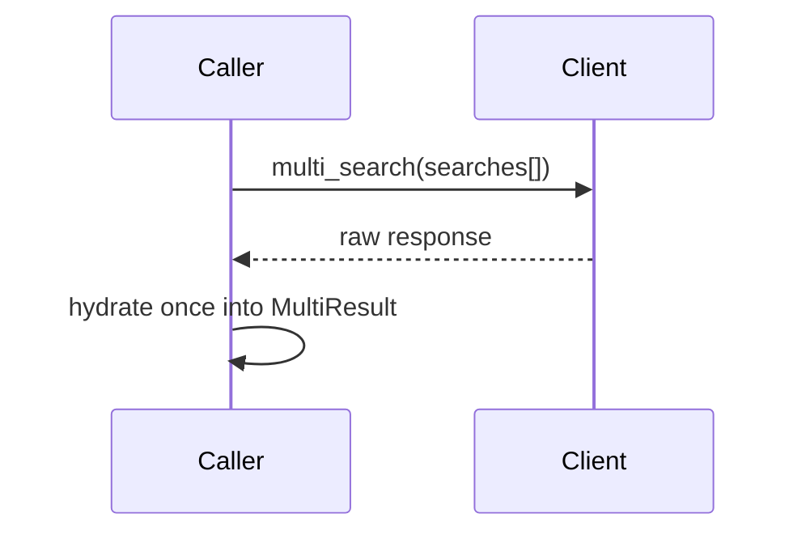
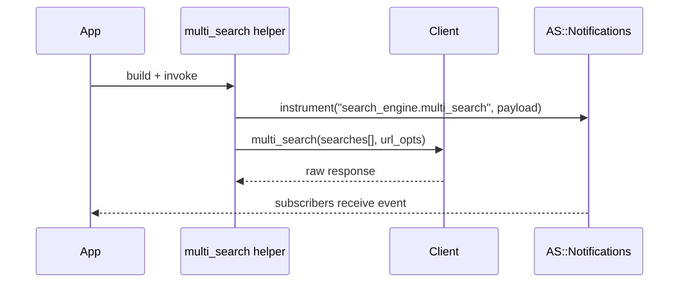

[← Back to Index](./index.md) · [Client](./client.md) · [Relation](./relation.md) · [Materializers](./materializers.md) · [Presets](./presets.md) · [Compiler](./compiler.md) · [Curation](./curation.md)

## Federated multi-search

### Overview

Federate multiple labeled `Relation`s into a single Typesense multi-search request while preserving order and mapping results back to labels.

- **Pure builder:** collects labeled relations, no HTTP
- **Order preserved:** results map back in insertion order
- **Unique labels:** labels are case-insensitive and must be unique
- **Common params:** `common:` is shallow-merged into each per-search payload; per-search keys win
- **No URL knobs in body:** cache options are handled as URL/common params by the client

### DSL

```ruby
res = SearchEngine.multi_search(common: { query_by: SearchEngine.config.default_query_by }) do |m|
  m.add :products, Product.where(category_id: 5).select(:id, :name).per(10)
  m.add :brands,   Brand.where('name:~rud').per(5)
end

res[:products].found
res.dig(:brands).to_a
res.labels #=> [:products, :brands]
```

### Label rules

- Accepts `String` or `Symbol`
- Canonicalization: `label.to_s.downcase.to_sym`
- Must be unique (case-insensitive)

### Common params merge

- Merge precedence: per-search params override `common:` keys
- URL-only keys filtered from bodies: `use_cache`, `cache_ttl` (these live in URL opts)
- Example:

```ruby
res = SearchEngine.multi_search(common: { q: 'milk', per_page: 50 }) do |m|
  m.add :products, Product.all.per(10) # per_page: 10 overrides common 50
  m.add :brands,   Brand.all           # per_page not present, inherits 50
end
```

### Guardrails

- **Unique labels**: accept `String` or `Symbol`; canonicalization is `label.to_s.downcase.to_sym` and labels must be unique (case-insensitive).
- **No URL-only knobs in bodies**: `use_cache`, `cache_ttl` are URL opts only and are filtered from both `common:` and per-search bodies.
- **Actionable errors**: duplicate labels, invalid relation (missing bound collection), or exceeding `SearchEngine.config.multi_search_limit` raise `ArgumentError` before any network call.
- **Per-search api_key**: unsupported in Typesense multi-search; set `SearchEngine.config.api_key` instead.

### Mapping (Relation → per-search payload)

| Relation aspect | Per-search key |
| --- | --- |
| query (`q`, default `*`) | `q` |
| fields to search | `query_by` |
| filters (AST / `where`) | `filter_by` |
| order (`order`) | `sort_by` |
| select (`select`) | `include_fields` |
| pagination (`page`/`per`) | `page`, `per_page` |
| infix (config or override) | `infix` |

Example payload shape:

```ruby
{
  collection: "products",
  q: "*",
  query_by: SearchEngine.config.default_query_by,
  filter_by: "category_id:=5",
  include_fields: "id,name",
  per_page: 10
}
```

### Compile flow

```mermaid
flowchart LR
  A[Relations] --> B[Params compile]
  B --> C[Merge common]
  C --> D[searches[] payload]
```

### Per-search API key policy

Per-search `api_key` is not supported by the underlying Typesense multi-search API. Passing a non-nil `api_key` to `m.add` raises an `ArgumentError`. Use the global `SearchEngine.config.api_key` instead.

### Result mapping

The helper pairs Typesense responses back to the original labels and model classes, returning a `SearchEngine::Multi::ResultSet` by default. For a dedicated wrapper with additional Hash-like APIs, see [MultiResult](#multiresult) below.

- `#[]` / `#dig(label)` → `SearchEngine::Result`
- `#labels` → `[:label_a, :label_b, ...]` in insertion order
- `#to_h` → `{ label: Result, ... }`
- `#each_pair` → iterate `(label, result)` in order

---

## MultiResult

A lightweight, ordered wrapper over the raw multi-search list that exposes labeled `Result` objects and stable insertion order. Hydration uses:

1. The model class captured alongside each label at request time
2. Fallback to the collection registry when the raw item exposes a `collection`
3. Fallback to `OpenStruct` otherwise



- Accessors: `#[]`, `#dig`, `#labels`, `#keys`, `#to_h`, `#each_label`
- Label canonicalization: `label.to_s.downcase.to_sym`
- Order: deterministic and identical to the order of `m.add`

Usage (shape matches the default helper):

```ruby
mr = SearchEngine.multi_search_result { |m| m.add :products, rel1; m.add :brands, rel2 }
mr[:products].found
mr.dig(:brands).to_a
mr.labels # => [:products, :brands]
```

Note: A convenience helper `SearchEngine.multi_search_result` returns a `MultiResult` directly without changing the default behavior of `SearchEngine.multi_search`.

### URL opts, caching, and limits

- URL-level caching knobs are passed as URL options only and never included in per-search bodies.
- `url_opts` are built from config: `{ use_cache: SearchEngine.config.use_cache, cache_ttl: SearchEngine.config.cache_ttl_s }`.
- A hard cap on the number of searches is enforced via `SearchEngine.config.multi_search_limit` (default: 50). Exceeding this limit raises before any network call.

### Raw response helper

If you prefer the raw response returned by the Typesense client, use:

```ruby
raw = SearchEngine.multi_search_raw(common: { query_by: SearchEngine.config.default_query_by }) do |m|
  m.add :products, Product.where(category_id: 5).per(10)
  m.add :brands,   Brand.where('name:~rud').per(5)
end
```

Errors are mapped to `SearchEngine::Errors` and, when available, the first failing label and status are included in the error message.

### Memoization & Ergonomics

- Single roundtrip: the HTTP request is performed exactly once by `Client#multi_search`.
- The raw response array is stored privately inside `MultiResult` and hydration into `{ label => Result }` occurs once.
- All accessors and helpers operate purely in-memory and never perform HTTP.



Helpers:

- `#to_h` returns a shallow copy of the mapping; insertion order preserved
- `#each_label` yields `(label, result)` in order; returns Enumerator without a block
- `#map_labels` is a convenience implemented via `each_label` and is equally pure

### See also

- [Client](./client.md) for URL/common params and error mapping
- [Relation](./relation.md) for query composition and compilation
- [Configuration](./configuration.md) for cache knobs and `multi_search_limit`

---

## Observability

[← Back to Index](./index.md) · [Client](./client.md) · [Observability](./observability.md)

Multi-search emits a single event around the network call:

- **Event**: `search_engine.multi_search`
- **Payload**: `{ searches_count, labels, http_status, source: :multi }`
- **Duration**: available as `ev.duration` for subscribers

See [Observability](./observability.md) for subscription patterns.

Redaction policy: payload does not include per-search bodies, `q`, or `filter_by`. Labels are considered safe.

Example compact log line shape:

```text
[se.multi] count=2 labels=products,brands status=200 duration=12.3ms cache=true ttl=60
```



## FAQ

- **How do `common:` and per-search params interact?** Shallow merge per search: keys from the relation override `common:`. URL-only keys (`use_cache`, `cache_ttl`) are filtered from both. See [Common params merge](#common-params-merge).
- **Can I run multi-search without `MultiResult`?** Yes. `SearchEngine.multi_search` returns `SearchEngine::Multi::ResultSet` by default. Use `SearchEngine.multi_search_result` to get a `MultiResult`, or `SearchEngine.multi_search_raw` for the raw Typesense response.
- **How do I debug a failing sub-search?** Use labels from the `search_engine.multi_search` event to identify the failing index, then run each `Relation#explain` individually. Consider subscribing to `SearchEngine::Notifications::CompactLogger` and see [Observability](./observability.md).

## Presets in multi-search

Presets are applied per search. Each entry in `searches[]` carries its own `preset` and respects the relation’s `preset_mode`:

- **mode=:merge**: pass through compiled params as-is (includes `preset`)
- **mode=:only**: keep only `collection`, `q`, `page`, `per_page`, `preset`
- **mode=:lock**: drop any keys listed in `SearchEngine.config.presets.locked_domains`

Required keys for multi-search are preserved even in `:only` mode: `collection`, `q`, `page`, `per_page`, plus `preset`.

Example:

```ruby
res = SearchEngine.multi_search do |m|
  m.add :products, SearchEngine::Product.preset(:popular_products).per(5)
  m.add :brands,   SearchEngine::Brand.preset(:brand_popularity, mode: :only).per(3)
end
```

See also: [Presets](./presets.md).

```mermaid
flowchart TD
  A[Relation] --> B[to_typesense_params]
  B --> C[Per‑search payload]
  C --> D{preset_mode}
  D -- merge --> E[Pass through]
  D -- only --> F[Keep collection,q,page,per_page + preset]
  D -- lock --> G[Drop keys in locked_domains]
  E --> H[searches[]]
  F --> H
  G --> H
```

## Curation in Multi‑search

Curation parameters are computed per relation via `Relation#to_typesense_params` and live inside each per‑search entry (body‑only). They do not appear at the top‑level or in URL options.

- **Per‑entry independence**: each `m.add` relation carries its own curation state
- **Pinned order**: `pinned_hits` preserves first‑occurrence order
- **Omission**: empty arrays are omitted; `filter_curated_hits` omitted when `nil`

Verbatim example from the ticket:

```ruby
res = SearchEngine.multi_search do |m|
  m.add :products, SearchEngine::Product.curate(pin: %w[p1 p2])
  m.add :brands,   SearchEngine::Brand.curate(hide: %w[b9 b10], filter_curated_hits: true)
end
```

Per‑search curation keys mapping (when present):

| Relation state | Per‑search key |
| --- | --- |
| `pinned` | `pinned_hits` (comma‑separated, stable order) |
| `hidden` | `hidden_hits` (comma‑separated) |
| `override_tags` | `override_tags` (comma‑separated) |
| `filter_curated_hits` | `filter_curated_hits` (boolean) |

### Mermaid — Per‑search Curation Placement

```mermaid
flowchart TD
  A[Relation] --> B[to_typesense_params]
  B --> C[Per‑search entry]
  C --> D{curation keys present?}
  D -- yes --> E[Include pinned_hits/hidden_hits/override_tags/filter_curated_hits]
  D -- no --> F[Omit curation keys]
  C --> G[Append to searches[]]
```

Backlinks: [Curation](./curation.md) · [Index](./index.md) · [Relation](./relation.md)
