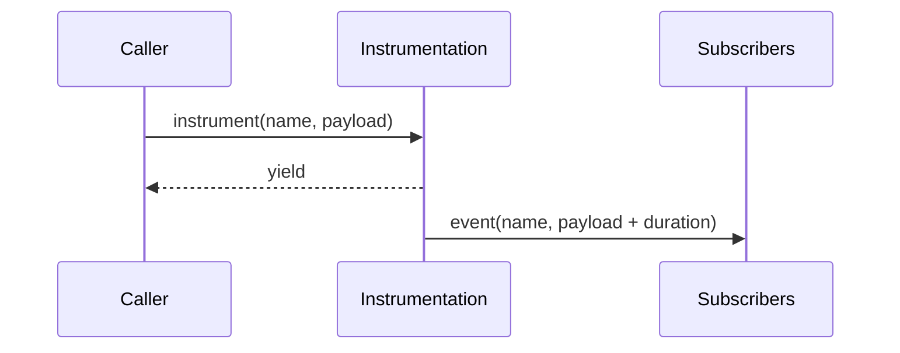
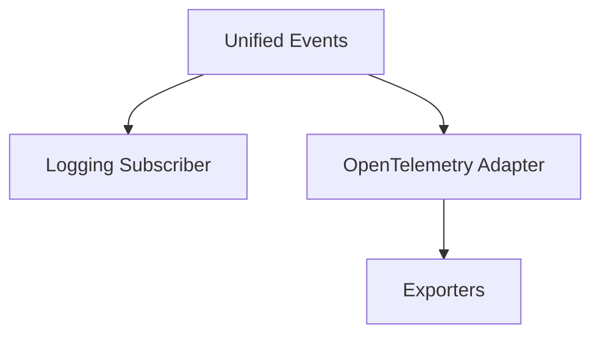
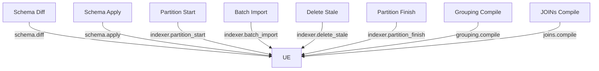
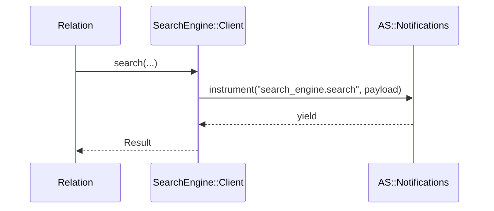

[← Back to Index](./index.md)

### Observability

Related: [DX](./dx.md), [Troubleshooting → Observability](./troubleshooting.md#observability)

This engine emits lightweight ActiveSupport::Notifications events around client calls and provides an opt-in compact logging subscriber. Events are redacted and stable to keep logs useful without leaking secrets.

- **Events**
  - `search_engine.search` — wraps `SearchEngine::Client#search`
  - `search_engine.multi_search` — wraps the top-level helper around `Client#multi_search`
  - `search_engine.schema.diff` — around schema diffing
  - `search_engine.schema.apply` — around schema apply lifecycle (create → reindex → swap → retention)
  - `search_engine.preset.apply` — emitted during compile when a preset is applied (keys-only payload)
  - `search_engine.indexer.partition_start` — partition processing started (inline or ActiveJob)
  - `search_engine.indexer.partition_finish` — partition processing finished with summary
  - `search_engine.indexer.batch_import` — each bulk import attempt
  - `search_engine.indexer.delete_stale` — stale delete lifecycle (started/ok/failed/skipped)
  - `search_engine.joins.compile` — compile-time summary of JOINs usage
  - `search_engine.grouping.compile` — compile-time summary of grouping (field/limit/missing_values)
  - `search_engine.selection.compile` — compile-time summary of selection counts (include/exclude/nested)
  - `search_engine.facet.compile` — compile-time summary of facets (fields/queries/cap)
  - `search_engine.highlight.compile` — compile-time summary of highlight options (fields/full/affix/tag)
  - `search_engine.synonyms.apply` — compile-time resolution of relation-level synonyms/stopwords flags
  - `search_engine.geo.compile` — compile-time summary of geo filters/sorts (counts and buckets)
  - `search_engine.vector.compile` — compile-time summary of vector/hybrid plan (no raw vectors)
  - `search_engine.hits.limit` — compile- or validate-stage hits limit summary

Duration is available via the event (`ev.duration`).

#### Unified helper (example)

```ruby
SearchEngine::Instrumentation.instrument("search_engine.search", collection: col) do |ctx|
  ctx[:params_preview] = SearchEngine::Instrumentation.redact(params)
  client.search(...)
end
```

#### Event flow (unified)



### Payload reference

- **collection/collections**: String or Array<String> of collections involved
- **params_preview**: Redacted params excerpt (single: Hash, multi: Array<Hash>)
- **url_opts**: `{ use_cache: Boolean, cache_ttl: Integer|nil }`
- **status/http_status**: Integer when available, otherwise `:ok`/`:error`
- **error_class/error_message**: Short error metadata when status is error
- **correlation_id**: Short token propagated across a request/thread
- **retries**: Attempts used (reserved; nil by default)
- **partition/partition_hash**: Numeric raw key or short hash for strings
- **into**: Physical collection name
- **duration_ms**: Float measured duration in milliseconds
- **grouping.compile**: `{ field: String, limit: Integer|nil, missing_values: Boolean, collection?: String, duration_ms?: Float }`
- **selection.compile**: `{ include_count: Integer, exclude_count: Integer, nested_assoc_count: Integer }`

Redaction rules:
- Sensitive keys matching `/key|token|secret|password/i` are redacted
- Only whitelisted param keys are preserved: `q`, `query_by`, `per_page`, `page`, `infix`, `filter_by`, `group_by`, `group_limit`, `group_missing_values`
- `q` is truncated when longer than 128 chars
- `filter_by` literals are masked while preserving structure (e.g., `price:>10` → `price:>***`)
- `filter_by` is never logged as-is; a `filter_hash` (sha1) is provided instead for stale deletes

| Key            | Type                 | Redaction |
|----------------|----------------------|-----------|
| `collection`   | String               | N/A |
| `collections`  | Array<String>        | N/A |
| `labels`       | Array<String>        | N/A |
| `searches_count` | Integer            | N/A |
| `params_preview` | Hash/Array<Hash>   | Whitelisted keys only; `q` truncated; `filter_by` masked |
| `url_opts`     | Hash                 | Includes only `use_cache` and `cache_ttl` |
| `status`/`http_status` | Integer or Symbol | N/A |
| `error_class`/`error_message` | String, nil | Truncated to config max |
| `correlation_id` | String             | N/A |
| `duration`     | Float (ms) via event | N/A |
| `partition`    | Numeric or hidden    | Hidden for strings; use `partition_hash` |
| `partition_hash` | String (sha1 prefix) | N/A |
| `filter_hash`  | String (sha1)        | Raw filter never logged |
| `group_by`     | String               | N/A |
| `group_limit`  | Integer, nil         | N/A |
| `group_missing_values` | Boolean      | N/A |
| `selection_include_count` | Integer   | Counts only |
| `selection_exclude_count` | Integer   | Counts only |
| `selection_nested_assoc_count` | Integer | Counts only |

For URL/cache knobs, see [Configuration](./configuration.md).

### Logging

Configure the structured logging subscriber and choose an output mode and sampling rate:

```ruby
SearchEngine.configure do |c|
  c.logging = OpenStruct.new(mode: :compact, level: :info, sample: 1.0, logger: Rails.logger)
end
```

- **Modes**: `:compact` (default) and `:json`
- **Sampling**: `sample` in 0.0..1.0; set `0.0` to disable emission
- **Redaction**: never logs raw filters or secrets; uses `Instrumentation.redact` and `params_preview`
- **Correlation ID**: included as a short token per line/object

Examples:

```text
[se.search] id=2a1f coll=products status=200 dur=32.1ms groups=— preset=— cur=0/0
```

```json
{"event":"search_engine.search","cid":"2a1f","collection":"products","status":200,"duration_ms":32.1}
```

Backlinks: [README](../README.md), [DX](./dx.md), [Testing](./testing.md), [CLI](./cli.md), [Client](./client.md), [Presets](./presets.md), [Curation](./curation.md), [Grouping](./grouping.md), [JOINs](./joins.md)

### Enable compact logging

One-liner subscriber that logs compact, single-line entries for both events:

```ruby
SearchEngine::Notifications::CompactLogger.subscribe
```

Options:

```ruby
SearchEngine::Notifications::CompactLogger.subscribe(
  logger: Rails.logger,    # default: SearchEngine.config.logger || STDOUT
  level: :info,            # :debug, :info, :warn, :error
  include_params: false,   # when true, logs only whitelisted param keys
  format: :kv              # :kv (default), :json
)
```

Example lines:

```
[se.search] collection=products status=200 duration=12.3ms cache=true ttl=60 grp=brand_id:1:mv q="milk" per_page=5
[se.multi] count=2 labels=products,brands status=200 duration=18.6ms cache=true ttl=60
```

JSON example (one line):

```json
{"event":"search","collection":"products","status":200,"duration.ms":12.3,"cache":true,"ttl":60,"group_by":"brand_id","group_limit":1,"group_missing_values":true}
```

### Event flow



Additional emitters:



---

## Relation execution events

Execution initiated by `SearchEngine::Relation` results in a single client call and emits `search_engine.search` with a compact, redacted payload. When a preset is applied, compile also emits `search_engine.preset.apply`. See [Presets](./presets.md#observability).

- **Event**: `search_engine.search`
- **Payload**: `{ collection, params_preview: Instrumentation.redact(params), url_opts: { use_cache, cache_ttl }, status, error_class }`
- **Source**: `SearchEngine::Client#search` (Relation delegates execution to the client)



Backlinks: [Relation](./relation.md), [Materializers](./materializers.md), [Client](./client.md), [Schema](./schema.md), [Indexer](./indexer.md)

### OpenTelemetry

This adapter translates unified events into OpenTelemetry spans when enabled and when the `opentelemetry-sdk` gem is present. It is disabled by default and adds ~zero overhead when disabled.

Enable via configuration:

```ruby
SearchEngine.configure do |c|
  c.opentelemetry = OpenStruct.new(enabled: false, service_name: "search_engine")
end
```

Event flow:


Notes:
- Activation is gated by SDK presence and `config.opentelemetry.enabled`.
- Spans are named after events (e.g., `search_engine.search`, `search_engine.compile`).
- Attributes are minimal and redacted; no raw query/filter strings are recorded.
- Correlation ID is attached as `se.cid` when present.
- Span status is set to ERROR when payload `status=:error` or `http_status>=400`.

Backlinks: [Index](./index.md), [Logging](./observability.md#logging), [Client](./client.md)

### Event catalog (extended)

| Event | When it fires | Key fields (subset) |
|-------|----------------|---------------------|
| `search_engine.facet.compile` | After facet plan normalization, before network I/O | `collection`, `fields_count`, `queries_count`, `max_facet_values`, `sort_flags`, `conflicts`, `duration_ms` |
| `search_engine.highlight.compile` | After highlight options merge and params emission | `collection`, `fields_count`, `full_fields_count`, `affix_tokens`, `snippet_threshold`, `tag_kind`, `duration_ms` |
| `search_engine.synonyms.apply` | When relation-level synonym/stopword flags resolve | `collection`, `use_synonyms`, `use_stopwords`, `source`, `duration_ms` |
| `search_engine.geo.compile` | After geo filters/sorts normalize (if present) | `collection`, `filters_count`, `shapes` (`point`/`rect`/`circle`), `sort_mode`, `radius_bucket`, `duration_ms` |
| `search_engine.vector.compile` | After vector/hybrid plan is built (if present) | `collection`, `query_vector_present`, `dims`, `hybrid_weight`, `ann_params_present`, `duration_ms` |
| `search_engine.hits.limit` | During compile (early limit) and/or post-fetch validation | `collection`, `early_limit`, `validate_max`, `applied_strategy`, `triggered`, `total_hits`, `duration_ms` |

Redaction notes:
- Vectors: only `query_vector_present`, `dims` (or bucket), `hybrid_weight`, and `ann_params_present`. Never log the raw vector.
- Geo: log counts and buckets; no raw coordinates. `radius_bucket` uses coarse buckets.
- Highlight tags: `tag_kind` only (`em`, `mark`, or `custom`), never full tag content.
- Facet queries: counts only; no raw expressions.

Backlinks: see feature pages for behavior and options — [Faceting](./faceting.md), [Highlighting](./highlighting.md), [Synonyms & Stopwords](./synonyms_stopwords.md), [Hit Limits](./hit_limits.md), related: [Ranking](./ranking.md), [Joins/Grouping](./joins_selection_grouping.md).
