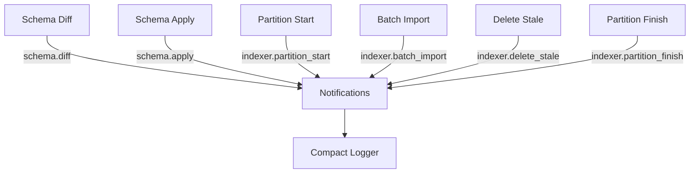
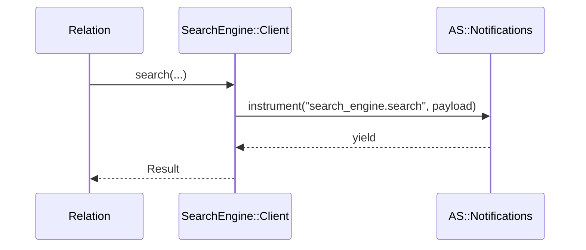

[← Back to Index](./index.md) · [Client](./client.md)

### Observability

This engine emits lightweight ActiveSupport::Notifications events around client calls and provides an opt-in compact logging subscriber. Events are redacted and stable to keep logs useful without leaking secrets.

- **Events**
  - `search_engine.search` — wraps `SearchEngine::Client#search`
  - `search_engine.multi_search` — wraps the top-level helper around `Client#multi_search`
  - `search_engine.schema.diff` — around schema diffing
  - `search_engine.schema.apply` — around schema apply lifecycle (create → reindex → swap → retention)
  - `search_engine.indexer.partition_start` — partition processing started (inline or ActiveJob)
  - `search_engine.indexer.partition_finish` — partition processing finished with summary
  - `search_engine.indexer.batch_import` — each bulk import attempt
  - `search_engine.indexer.delete_stale` — stale delete lifecycle (started/ok/failed/skipped)

Duration is available via the event (`ev.duration`).

### Payload reference

- **collection/collections**: String or Array<String> of collections involved
- **params**: Redacted params excerpt (single: Hash, multi: Array<Hash>)
- **url_opts**: `{ use_cache: Boolean, cache_ttl: Integer|nil }`
- **status/http_status**: Integer when available, otherwise `:ok`/`:error`
- **error_class**: String or nil
- **retries**: Attempts used (reserved; nil by default)
- **partition/partition_hash**: Numeric raw key or short hash for strings
- **into**: Physical collection name
- **duration_ms**: Float measured duration in milliseconds

Redaction rules:
- Sensitive keys matching `/key|token|secret|password/i` are redacted
- Only whitelisted param keys are preserved: `q`, `query_by`, `per_page`, `page`, `infix`, `filter_by`
- `q` is truncated when longer than 128 chars
- `filter_by` literals are masked while preserving structure (e.g., `price:>10` → `price:>***`)
- `filter_by` is never logged as-is; a `filter_hash` (sha1) is provided instead for stale deletes

| Key            | Type                 | Redaction |
|----------------|----------------------|-----------|
| `collection`   | String               | N/A |
| `collections`  | Array<String>        | N/A |
| `labels`       | Array<String>        | N/A |
| `searches_count` | Integer            | N/A |
| `params`       | Hash/Array<Hash>     | Whitelisted keys only; `q` truncated; `filter_by` masked |
| `url_opts`     | Hash                 | Includes only `use_cache` and `cache_ttl` |
| `status`/`http_status` | Integer or Symbol | N/A |
| `error_class`  | String, nil          | N/A |
| `retries`      | Integer, nil         | Reserved; nil by default |
| `duration`     | Float (ms) via event | N/A |
| `partition`    | Numeric or hidden    | Hidden for strings; use `partition_hash` |
| `partition_hash` | String (sha1 prefix) | N/A |
| `filter_hash`  | String (sha1)        | Raw filter never logged |

For URL/cache knobs, see [Configuration](./configuration.md).

### Enable compact logging

One-liner subscriber that logs compact, single-line entries for both events:

```ruby
SearchEngine::Notifications::CompactLogger.subscribe
```

Options:

```ruby
SearchEngine::Notifications::CompactLogger.subscribe(
  logger: Rails.logger,    # default: SearchEngine.config.logger || STDOUT
  level: :info,            # :debug, :info, :warn, :error
  include_params: false,   # when true, logs only whitelisted param keys
  format: :kv              # :kv (default), :json
)
```

Example lines:

```
[se.search] collection=products status=200 duration=12.3ms cache=true ttl=60 q="milk" per_page=5
[se.multi] count=2 labels=products,brands status=200 duration=18.6ms cache=true ttl=60
```

New KV examples:

```
event=schema.diff collection=SearchEngine::Product fields.changed=0 fields.added=3 fields.removed=0 in_sync=false duration_ms=12.1

event=schema.apply collection=SearchEngine::Product into=products_20251001_120000_001 alias_swapped=true retention_deleted_count=2 status=ok duration_ms=842.4

event=indexer.partition_start collection=SearchEngine::Product into=products_20251001_120000_001 partition=9 dispatch_mode=inline timestamp=2025-10-02T12:00:00Z

event=indexer.partition_finish collection=SearchEngine::Product into=products_20251001_120000_001 partition=9 batches_total=4 docs_total=8000 success_total=8000 failed_total=0 status=ok duration_ms=5234.7

event=indexer.batch_import collection=products into=products batch_index=1 docs_count=2000 success_count=2000 failure_count=0 attempts=1 http_status=200 bytes_sent=123456 duration_ms=317.9

event=indexer.delete_stale collection=SearchEngine::Product into=products_20251001_120000_001 partition=ab12cd34 filter_hash=f3e1... deleted_count=120 status=ok duration_ms=210.0
```

JSON example (one line):

```json
{"event":"schema.apply","collection":"SearchEngine::Product","into":"products_20251001_120000_001","alias_swapped":true,"retention_deleted_count":2,"status":"ok","duration_ms":842.4}
```

### Event flow



---

## Relation execution events

Execution initiated by `SearchEngine::Relation` results in a single client call and emits `search_engine.search` with a compact, redacted payload.

- **Event**: `search_engine.search`
- **Payload**: `{ collection, params: Observability.redact(params), url_opts: { use_cache, cache_ttl }, status, error_class }`
- **Source**: `SearchEngine::Client#search` (Relation delegates execution to the client)



Backlinks: [Relation](./relation.md), [Materializers](./materializers.md), [Client](./client.md), [Schema](./schema.md), [Indexer](./indexer.md)
