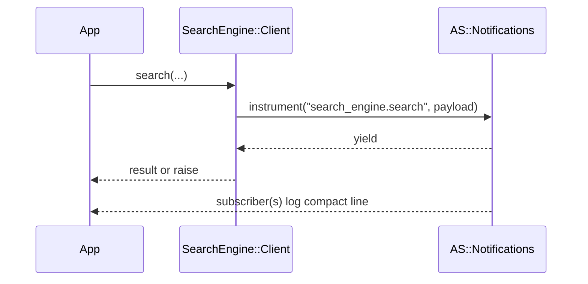

[← Back to Index](./index.md) · [Client](./client.md)

### Observability

This engine emits lightweight ActiveSupport::Notifications events around client calls and provides an opt-in compact logging subscriber. Events are redacted and stable to keep logs useful without leaking secrets.

- **Events**
  - `search_engine.search` — wraps `SearchEngine::Client#search`
  - `search_engine.multi_search` — wraps `SearchEngine::Client#multi_search`

Duration is available via the event (`ev.duration`).

### Payload reference

- **collection/collections**: String or Array<String> of collections involved
- **params**: Redacted params excerpt (single: Hash, multi: Array<Hash>)
- **url_opts**: `{ use_cache: Boolean, cache_ttl: Integer|nil }`
- **status**: Integer when available, otherwise `:ok`/`:error`
- **error_class**: String or nil
- **retries**: Attempts used (reserved; nil by default)

Redaction rules:
- Sensitive keys matching `/key|token|secret|password/i` are redacted
- Only whitelisted param keys are preserved: `q`, `query_by`, `per_page`, `page`, `infix`, `filter_by`
- `q` is truncated when longer than 128 chars
- `filter_by` literals are masked while preserving structure (e.g., `price:>10` → `price:>***`)

| Key           | Type                 | Redaction |
|---------------|----------------------|-----------|
| `collection`  | String               | N/A |
| `collections` | Array<String>        | N/A |
| `params`      | Hash/Array<Hash>     | Whitelisted keys only; `q` truncated; `filter_by` masked |
| `url_opts`    | Hash                 | Includes only `use_cache` and `cache_ttl` |
| `status`      | Integer or Symbol    | N/A |
| `error_class` | String, nil          | N/A |
| `retries`     | Integer, nil         | Reserved; nil by default |
| `duration`    | Float (ms) via event | N/A |

For URL/cache knobs, see [Configuration](./configuration.md).

### Enable compact logging

One-liner subscriber that logs compact, single-line entries for both events:

```ruby
SearchEngine::Notifications::CompactLogger.subscribe
```

Options:

```ruby
SearchEngine::Notifications::CompactLogger.subscribe(
  logger: Rails.logger,    # default: SearchEngine.config.logger || STDOUT
  level: :info,            # :debug, :info, :warn, :error
  include_params: false    # when true, logs only whitelisted param keys
)
```

Example lines:

```
[se.search] collection=products status=200 duration=12.3ms cache=true ttl=60 q="milk" per_page=5
[se.multi] collections=products,brands status=200 duration=18.6ms searches=2 cache=true ttl=60
```

`filter_by` is never logged raw; when `include_params` is true and `filter_by` is present, it is rendered as `filter_by=***`.

### Allowed snippets

Instrument inside your own code if needed:

```ruby
ActiveSupport::Notifications.instrument(
  "search_engine.search",
  collection: collection,
  params: SearchEngine::Observability.redact(params)
) do
  # perform HTTP request
end
```

Subscribe directly without the helper:

```ruby
ActiveSupport::Notifications.subscribe("search_engine.search") do |*args|
  ev = ActiveSupport::Notifications::Event.new(*args)
  Rails.logger.info(
    "[se.search] collection=#{ev.payload[:collection]} status=#{ev.payload[:status]} duration=#{ev.duration.round(1)}ms"
  )
end
```

### Event flow


