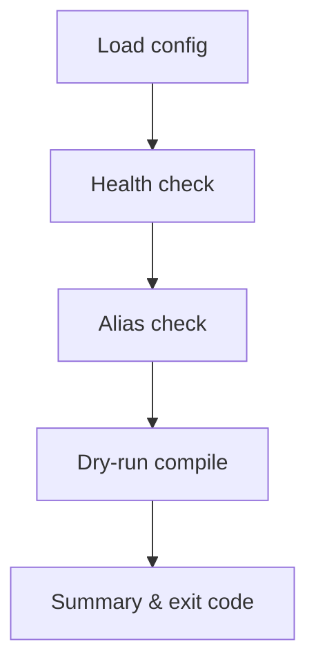
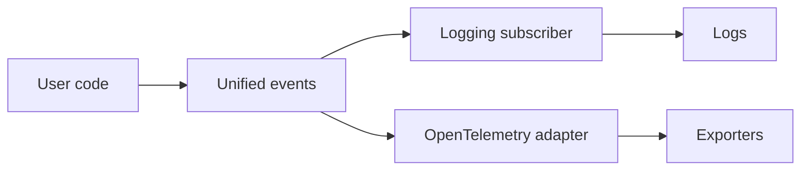

[← Back to Index](./index.md)

# Observability, DX & Testing

## Overview

This page brings together the engine’s observability (events, logging, OpenTelemetry), developer‑experience (DX) helpers, the `doctor` CLI, and testing utilities. It shows how unified events flow through subscribers and OTel, how to safely introspect requests with no network I/O, how to validate environments with `doctor`, and how to run tests fully offline.

See also: [Observability](./observability.md), [DX](./dx.md), [CLI](./cli.md), [Testing](./testing.md).

## Unified events: catalog & payload schema

Unified events are emitted via `ActiveSupport::Notifications` with compact, redacted payloads and stable keys. The most common event names:

- `search_engine.search` — single search execution
- `search_engine.multi_search` — batched multi‑search wrapper
- `search_engine.schema.diff`, `search_engine.schema.apply` — schema lifecycle
- `search_engine.preset.apply`, `search_engine.preset.conflict` — preset usage and conflicts
- `search_engine.curation.compile`, `search_engine.curation.conflict` — curation counts/flags and conflicts
- `search_engine.indexer.partition_start`, `search_engine.indexer.partition_finish`, `search_engine.indexer.batch_import`, `search_engine.indexer.delete_stale` — indexing
- Compile‑time summaries: `search_engine.joins.compile`, `search_engine.grouping.compile`, `search_engine.selection.compile`

High‑level payload schema (keys are redacted where needed):

- `collection`/`collections`: the logical collection(s)
- `params_preview`: whitelisted subset of compiled params; secrets/literals masked
- `url_opts`: cache knobs (`use_cache`, `cache_ttl`)
- `http_status`/`status`: status code or symbolic status
- `error_class`/`error_message`: short error metadata on failure
- `correlation_id` (logged as `cid`): short token for request correlation
- `duration_ms`: measured time (ms); captured in logs/OTel; the AS::Notifications event duration is also available
- Feature counts/flags: grouping, selection, preset/curation counts, partition hints, attempts, etc.

Redaction rules & caps:

- Sensitive keys (`/key|token|secret|password/i`) never logged; values masked, structure preserved
- Whitelist for `params_preview` (e.g., `q`, `query_by`, `per_page`, `page`, `filter_by` with masked literals)
- Long strings truncated deterministically with a short hash suffix

For a full table of keys, see [Observability → Payload reference](./observability.md#payload-reference).

## Logging subscriber

A lightweight subscriber formats unified events as either compact key‑value lines or JSON.

- **Modes**: `:compact` (default), `:json`
- **Knobs**: `level`, `sample` (0.0..1.0), `logger`
- **Payloads**: use the same redacted schema; correlation id appears as `cid`

Example (compact):

```text
[se.search] id=2a1f coll=products status=200 dur=32.1ms q="milk" per_page=5
```

Example (JSON):

```json
{"event":"search_engine.search","cid":"2a1f","collection":"products","status":200,"duration_ms":32.1}
```

See [Observability → Logging](./observability.md#logging) for subscriber APIs and options.

## OpenTelemetry overview

When the OTel SDK is present and enabled, unified events are translated into spans. Activation is gated by both installation and config (`enabled?`) and uses `service_name` for resource identification.

- **Span names**: event names (e.g., `search_engine.search`)
- **Attributes**: mapped from redacted payload keys; no raw secrets or filter literals
- **Status**: set to ERROR when `status=:error` or `http_status>=400`

See [Observability → OpenTelemetry](./observability.md#opentelemetry) for setup details.

## DX helpers

DX helpers live on `Relation` and are network‑safe by default when you use dry‑run or JSON rendering.

- `explain` — human summary of resolved options, grouping/joins, presets/curation, conflicts, and predicted events
- `to_curl` — single‑line cURL (API keys masked as `***`)
- `to_params_json(pretty: true)` — redacted, stable‑order JSON body for copy/paste
- `dry_run!` — compile/validate without I/O, returning `{ url:, body:, url_opts: }`

Example (safe introspection):

```ruby
rel = SearchEngine::Product.where(active: true).per(5)

puts rel.to_params_json(pretty: true)
# => "{\n  \"filter_by\": \"active:=***\", ... }"

preview = rel.dry_run!
# => { url: "https://.../collections/products/documents/search",
#      body: "{...}", url_opts: { use_cache: true, cache_ttl: 60 } }

puts rel.explain
```

See [DX](./dx.md) for deeper examples and redaction policy.

## Doctor CLI walkthrough

Run the consolidated environment and wiring checks:

```bash
rails search_engine:doctor
```

Checks (conceptual): config/ENV presence, health/connectivity, API key validity, alias resolution for registered collections, a dry‑run single search and multi‑search (no I/O), logging mode, and OpenTelemetry status.

- Output: human table by default; JSON with `FORMAT=json`
- Exit codes: `0` on success/warnings, `1` on any failure
- Flags: `VERBOSE=1` for longer hints, `TIMEOUT=seconds`, temporary `HOST`/`PORT`/`PROTOCOL`

Doctor flow:



See [CLI](./cli.md#doctor-flow) for specifics.

## Testing utilities

Use the stub client for offline tests and event helpers to assert on unified events.

- Stub client: `SearchEngine::Test::StubClient` queues responses and captures redacted requests
- Event matchers: RSpec `emit_event`, Minitest assertions and `capture_events`
- Safety: captured payloads are redacted and CI‑log friendly

Quick start:

```ruby
# test_helper.rb or spec_helper.rb
require "search_engine/test"

SearchEngine.configure do |c|
  c.client = SearchEngine::Test::StubClient.new
end

stub = SearchEngine.config.client
stub.enqueue_response(:search, { "hits" => [], "found" => 0, "out_of" => 0 })
```

Assertions:

```ruby
# RSpec
expect { rel.to_a }.to emit_event("search_engine.search").with(hash_including(collection: "products"))

# Minitest
include SearchEngine::Test::MinitestAssertions
assert_emits("search_engine.search", payload: ->(p) { p[:collection] == "products" }) { rel.to_a }
```

See [Testing](./testing.md) for the full API.

## Diagrams

Event flow (compact):



Doctor flow:


## Troubleshooting & tips

- Use **doctor** for environment and connectivity issues; switch to `FORMAT=json` for machines
- Use **DX helpers** (`dry_run!`, `to_params_json`) to inspect request shape safely and deterministically
- Use **Testing utilities** (stub client, event capture) for offline debugging and CI stability
- See [Troubleshooting → Observability](./troubleshooting.md#observability), [Troubleshooting → DX](./troubleshooting.md#dx), and [Troubleshooting → CLI](./troubleshooting.md#cli)
- Error UX includes hints and did‑you‑mean suggestions where available; see [Debugging](./debugging.md)

Authors of feature pages (joins, grouping, presets, curation) should include a backlink to this consolidated page so readers can discover the unified tooling.

---

Related: [Observability](./observability.md), [DX](./dx.md), [CLI](./cli.md), [Testing](./testing.md), [Relation guide](./relation_guide.md), [Cookbook: queries](./cookbook_queries.md), [Presets](./presets.md), [Curation](./curation.md)
