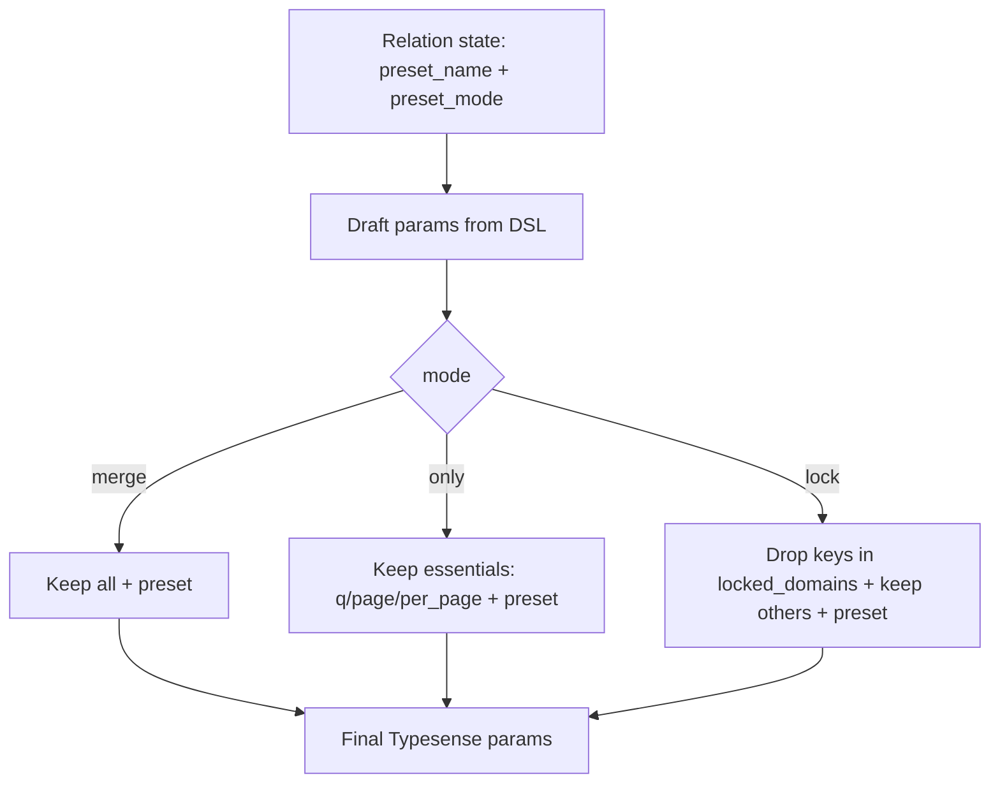

# Presets: Relation#preset and Merge Strategies

Back to: [Index](./index.md) · See also: [Relation](./relation.md) · Multi-search: [Multi](./multi_search.md)

## Overview

Apply a server-side preset to a relation with a selectable merge strategy using `Relation#preset(name, mode: :merge)`.

### Examples

```ruby
# Merge (default)
SearchEngine::Product.preset(:popular_products)
  .where(active: true)
  .order(updated_at: :desc)

# Only preset
SearchEngine::Product.preset(:aggressive_sale, mode: :only).page(1).per(24)

# Locked preset (chain cannot override preset filters/sorts)
SearchEngine::Product.preset(:brand_curated, mode: :lock).order(price: :asc) # order will be dropped
```

#### Example (from ticket)

```ruby
rel = SearchEngine::Product
        .preset(:popular_products, mode: :only)
        .where(active: true)
rel.to_typesense_params
# => { q: "*", page: 1, per_page: 10, preset: "prod_popular_products" }
```

## Namespacing

Effective preset name is computed using global presets configuration (`SearchEngine.config.presets`). When enabled and a non-empty `namespace` is present, the effective name is `"#{namespace}_#{token}"`; otherwise the token is used as-is.

- **Enabled + namespace:** `prod_popular_products`
- **Disabled or no namespace:** `popular_products`

## Strategies

- **mode=:merge (default)**: preset is emitted along with all chain-derived params; on key overlaps, chain wins (Typesense semantics). No conflicts recorded.
- **mode=:only**: preset is emitted and only essential params are kept from the chain. Optional params like `filter_by`, `sort_by`, `include_fields` are dropped. No conflicts recorded.
- **mode=:lock**: preset is emitted and chain params are kept except those managed by preset (`filter_by`, `sort_by`, `include_fields`, etc.). Dropped keys are recorded and surfaced by `explain`.

### Strategy comparison

| Mode  | What is sent | Who wins on overlaps | Conflicts recorded |
|------|---------------|----------------------|--------------------|
| merge | preset + all chain params | chain | no |
| only  | preset + essentials (q, page, per_page) | n/a (others dropped) | no |
| lock  | preset + chain minus locked domains | preset | yes (dropped keys) |

## Configuration

Customize which param keys are considered preset-managed in `:lock` mode:

- **Default:** `SearchEngine.config.presets.locked_domains = %i[filter_by sort_by include_fields exclude_fields]`
- The value is normalized to Symbols and used as a Set for deterministic pruning.

## Conflicts

Conflicts are detected only in `mode: :lock` and occur when a compiled chain param key belongs to `SearchEngine.config.presets.locked_domains`. Such keys are dropped from the final params and recorded as conflicts.

- **Accessor:** `Relation#preset_conflicts` → `[{ key: :filter_by, reason: :locked_by_preset }, ...]` (deterministic, frozen)
- **Explain:** lists the effective preset and one line per dropped key with a humanized reason.
- **Inspect:** appends a compact token: `preset=prod_brand_curated(mode=lock; conflicts=filter_by,sort_by)`
- **Redaction:** keys only; raw values are not included anywhere.

Verbatim example snippet:

```
Preset: prod_brand_curated (mode: lock)
Dropped: sort_by (locked by preset)
```

### Instrumentation

When conflicts are present, a single event is emitted per compile:

- **Event:** `search_engine.preset.conflict`
- **Payload:**
  - `keys` (Array<Symbol>) — dropped keys (redacted; names only)
  - `mode` (Symbol) — preset mode (always `:lock` here)
  - `preset_name` (String) — effective preset name
  - `count` (Integer) — number of dropped keys

Backlinks: [Index](./index.md) · [Relation](./relation.md) · [Multi-search](./multi_search.md)

### Mermaid — Conflict Resolution Flow

```mermaid
flowchart TD
  A[Draft params from chain] --> B[locked_domains from config]
  P[Preset mode] -->|lock| C{key in locked_domains?}
  P -->|merge/only| J[No conflict detection]
  C -- yes --> D[Drop key from params]
  D --> E[Record conflict {key, reason: locked_by_preset}]
  E --> F[Emit event search_engine.preset.conflict once]
  D --> G[Final params]
  C -- no --> G
  G --> H[Relation#explain includes preset + conflicts]
```

## Explain & Inspect

- `inspect` adds a compact token, e.g., `preset=prod_popular_products(mode=lock; conflicts=filter_by,sort_by)` when applied and conflicts exist.
- `explain` prints a `Preset:` header and, for `mode: :lock`, a deterministic list of `Dropped:` lines with humanized reasons (as above). Redaction-safe by construction.

## Mermaid: strategy flow



## Notes

- Essential params include: `q`, `page`, `per_page`.
- Locked domains default to: `filter_by`, `sort_by`, `include_fields`, `exclude_fields`.
- The API is immutable and copy-on-write; invalid mode or name raises `ArgumentError`.
