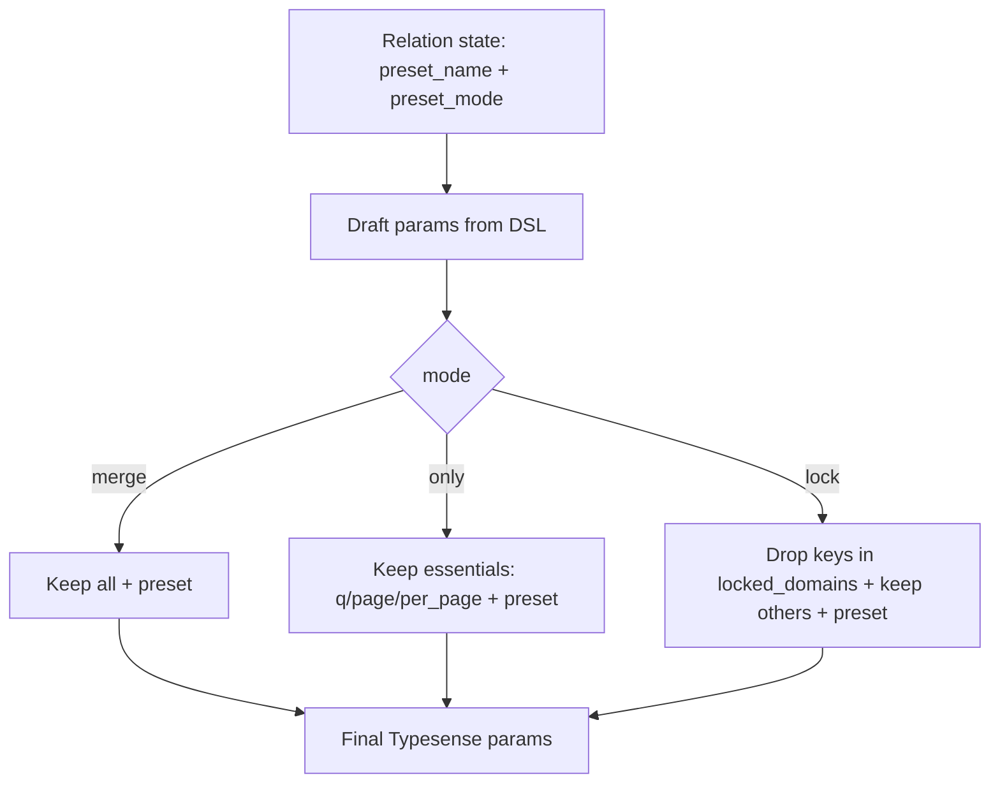

# Presets: Relation#preset and Merge Strategies

Back to: [Index](./index.md) · See also: [Relation](./relation.md) · Multi-search: [Multi](./multi_search.md)

## Overview

Apply a server-side preset to a relation with a selectable merge strategy using `Relation#preset(name, mode: :merge)`.

### Examples

```ruby
# Merge (default)
SearchEngine::Product.preset(:popular_products)
  .where(active: true)
  .order(updated_at: :desc)

# Only preset
SearchEngine::Product.preset(:aggressive_sale, mode: :only).page(1).per(24)

# Locked preset (chain cannot override preset filters/sorts)
SearchEngine::Product.preset(:brand_curated, mode: :lock).order(price: :asc) # order will be dropped
```

#### Example (from ticket)

```ruby
rel = SearchEngine::Product
        .preset(:popular_products, mode: :only)
        .where(active: true)
rel.to_typesense_params
# => { q: "*", page: 1, per_page: 10, preset: "prod_popular_products" }
```

## Namespacing

Effective preset name is computed using global presets configuration (`SearchEngine.config.presets`). When enabled and a non-empty `namespace` is present, the effective name is `"#{namespace}_#{token}"`; otherwise the token is used as-is.

- **Enabled + namespace:** `prod_popular_products`
- **Disabled or no namespace:** `popular_products`

## Strategies

- **mode=:merge (default)**: preset is emitted along with all chain-derived params; on key overlaps, chain wins (Typesense semantics). No conflicts recorded.
- **mode=:only**: preset is emitted and only essential params are kept from the chain. Optional params like `filter_by`, `sort_by`, `include_fields` are dropped. No conflicts recorded.
- **mode=:lock**: preset is emitted and chain params are kept except those managed by preset (`filter_by`, `sort_by`, `include_fields`, etc.). Dropped keys are recorded and surfaced by `explain`.

### Strategy comparison

| Mode  | What is sent | Who wins on overlaps | Conflicts recorded |
|------|---------------|----------------------|--------------------|
| merge | preset + all chain params | chain | no |
| only  | preset + essentials (q, page, per_page) | n/a (others dropped) | no |
| lock  | preset + chain minus locked domains | preset | yes (dropped keys) |

## Configuration

Customize which param keys are considered preset-managed in `:lock` mode:

- **Default:** `SearchEngine.config.presets.locked_domains = %i[filter_by sort_by include_fields exclude_fields]`
- The value is normalized to Symbols and used as a Set for deterministic pruning.

## Explain & Inspect

- `inspect` adds a compact token, e.g., `preset=prod_popular_products(mode=lock)` when applied.
- `explain` prints a `preset:` line and, for `mode: :lock`, includes `dropped:` keys, e.g. `preset: prod_popular_products (mode=lock dropped: filter_by,sort_by)`.

## Mermaid: strategy flow



## Notes

- Essential params include: `q`, `page`, `per_page`.
- Locked domains default to: `filter_by`, `sort_by`, `include_fields`, `exclude_fields`.
- The API is immutable and copy-on-write; invalid mode or name raises `ArgumentError`.
