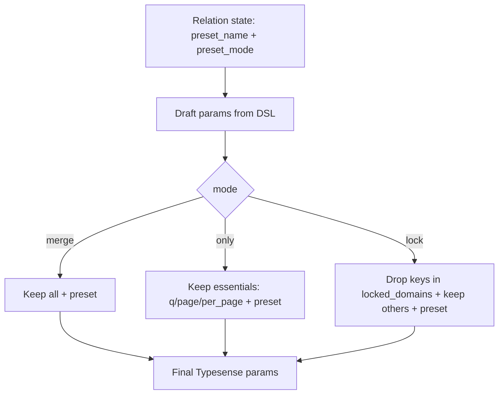
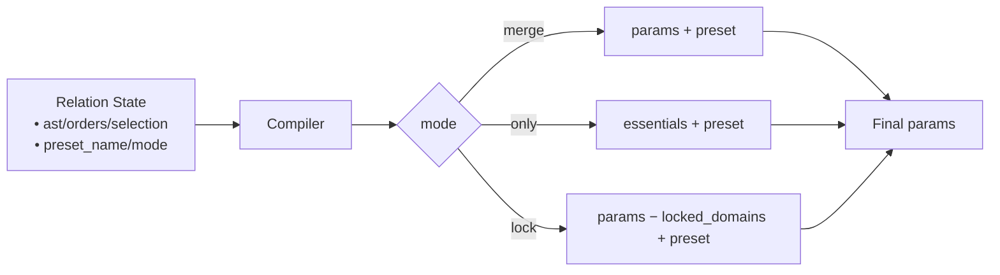

# Presets

## Overview

Presets are server-side bundles of query options that you can attach to a relation to enforce consistent filters, sorts, or selections. They provide a global config (optional namespace and enablement), per‑collection defaults, and a per‑relation `preset(name, mode:)` DSL.

- **Why**: enforce consistent defaults, reuse across surfaces, and keep chains concise.
- **Where**: global config under `SearchEngine.config.presets`; model-level `default_preset`; relation-level `Relation#preset`.

## Config & Default preset

Presets are namespaced when enabled. The effective name is computed as `"#{namespace}_#{token}"` when both `enabled` and `namespace` are set; otherwise the bare token is used.

- **Global config**: `enabled`, `namespace`, and `locked_domains` (used by `:lock` mode)
- **Model default**: declare `default_preset :token` on a `SearchEngine::Base` subclass
- **Reader**: `YourModel.default_preset_name` returns the effective name (or `nil` if none)

```ruby
# Initializer
SearchEngine.configure do |c|
  c.presets.enabled   = true
  c.presets.namespace = "prod"
  # Optional: customize locked domains for :lock mode
  # c.presets.locked_domains = %i[filter_by sort_by include_fields exclude_fields]
end

class SearchEngine::Product < SearchEngine::Base
  default_preset :popular_products
end

SearchEngine::Product.default_preset_name
# => "prod_popular_products"
```

Notes:
- Namespacing is ignored when `enabled` is false; tokens remain usable as declared.
- `locked_domains` is normalized to Symbols and used by the compiler to prune keys in `:lock` mode.

## Relation DSL

Apply a preset with copy‑on‑write semantics, validate inputs, and keep chaining ergonomics:

```ruby
# Merge (default)
SearchEngine::Product.preset(:popular_products)
  .where(active: true)
  .order(updated_at: :desc)

# Only preset
SearchEngine::Product.preset(:aggressive_sale, mode: :only).page(1).per(24)

# Locked preset (chain cannot override preset filters/sorts)
SearchEngine::Product.preset(:brand_curated, mode: :lock).order(price: :asc) # order will be dropped
```

- `Relation#preset(name, mode: :merge)` validates the name and mode
- Readers: `rel.preset_name` and `rel.preset_mode` (defaults to `:merge`)
- `inspect`/`explain` show the preset and, for `:lock`, any dropped keys
- Presets affect the compiler stage only; no global config is mutated

## Strategies (`:merge`, `:only`, `:lock`)

| Mode  | What is sent | Who wins on overlaps | Conflicts recorded |
|------|---------------|----------------------|--------------------|
| merge | preset + all chain params | chain | no |
| only  | preset + essentials (`q`, `page`, `per_page`) | n/a (others dropped) | no |
| lock  | preset + chain minus locked domains | preset | yes (dropped keys) |

- **merge**: Send preset and all compiled params. When Typesense sees overlapping knobs, the later param wins; here the chain wins. No conflicts are recorded.
- **only**: Keep only essentials from the chain (`q`, `page`, `per_page`) and send the preset. Use for strict server‑defined queries with local pagination.
- **lock**: Drop chain keys that belong to `SearchEngine.config.presets.locked_domains` (default: `filter_by`, `sort_by`, `include_fields`, `exclude_fields`), record dropped keys, and include them in `explain`.

### Mermaid — Strategy flow



## Compiler mapping & pruning

The compiler injects `preset: <effective_name>` into the params and prunes keys according to the chosen strategy.

- **only**: keep `q`, `page`, `per_page`; drop the rest
- **lock**: drop keys in `SearchEngine.config.presets.locked_domains` and record them
- **merge**: no pruning

Compact mapping:

| Relation state               | Compiler output              |
|-----------------------------|------------------------------|
| `preset_name`, `preset_mode`| `preset`, `_preset_mode`     |
| state → params              | `q`, `filter_by`, `sort_by`, `include_fields`, `page`, `per_page`, ... |
| pruning (only)              | keep essentials only         |
| pruning (lock)              | drop `locked_domains` keys   |

### Mermaid — State → params mapping



Example (reused):

```ruby
rel = SearchEngine::Product
        .preset(:popular_products, mode: :only)
        .where(active: true)
rel.to_typesense_params
# => { q: "*", page: 1, per_page: 10, preset: "prod_popular_products" }
```

## Conflicts

Conflicts are detected only in `mode: :lock` and occur when a compiled chain key belongs to `SearchEngine.config.presets.locked_domains`. Such keys are dropped from the final params and recorded.

- Accessor: `Relation#preset_conflicts` → `[{ key: :filter_by, reason: :locked_by_preset }, ...]` (deterministic, frozen)
- Explain: lists the effective preset and a line per dropped key with a humanized reason
- Inspect: appends a compact token: `preset=prod_brand_curated(mode=lock; conflicts=filter_by,sort_by)`
- Redaction: keys only; no raw values

Example snippet:

```text
Preset: prod_brand_curated (mode: lock)
Dropped: sort_by (locked by preset)
```

### Mermaid — Conflict resolution

```mermaid
flowchart TD
  A[Draft params from chain] --> B[locked_domains from config]
  P[Preset mode] -->|lock| C{key in locked_domains?}
  P -->|merge/only| J[No conflict detection]
  C -- yes --> D[Drop key from params]
  D --> E[Record conflict {key, reason: locked_by_preset}]
  E --> F[Emit event search_engine.preset.conflict once]
  D --> G[Final params]
  C -- no --> G
  G --> H[Relation#explain includes preset + conflicts]
```

## Multi‑search

Presets are applied per search entry. Each `searches[]` item carries its own `preset` and respects that relation’s mode.

- `:merge`: pass through compiled params (includes `preset`)
- `:only`: keep only `collection`, `q`, `page`, `per_page`, and `preset`
- `:lock`: drop keys listed in `SearchEngine.config.presets.locked_domains`

Example (reused):

```ruby
res = SearchEngine.multi_search do |m|
  m.add :products, SearchEngine::Product.preset(:popular_products).per(5)
  m.add :brands,   SearchEngine::Brand.preset(:brand_popularity, mode: :only).per(3)
end
```

### Mermaid — Multi‑search placement

```mermaid
flowchart TD
  A[Relation] --> B[to_typesense_params]
  B --> C[Per‑search payload]
  C --> D{preset_mode}
  D -- merge --> E[Pass through]
  D -- only --> F[Keep collection,q,page,per_page + preset]
  D -- lock --> G[Drop keys in locked_domains]
  E --> H[searches[]]
  F --> H
  G --> H
```

## Observability & troubleshooting

Events (keys and counts only; values redacted elsewhere):

- `search_engine.preset.apply` — emitted once per compile when a preset is present
  - Payload: `preset_name`, `mode`, `locked_domains`, `pruned_keys`
- `search_engine.preset.conflict` — emitted once per compile in `:lock` mode when keys were dropped
  - Payload: `keys`, `count`, `mode`, `preset_name`

Logging subscriber (compact):
- Text: appends `pz=<name>|m=<mode>|pk=<count>|ld=<count>`; when `pruned_keys.size <= 3`, includes `pk=[k1,k2]`
- JSON: adds `preset_name`, `preset_mode`, `preset_pruned_keys_count`, `preset_locked_domains_count`, and optionally `preset_pruned_keys`

## FAQ

- **How does namespacing interact with `enabled: false`?** Namespacing is ignored when disabled; tokens are used as declared.
- **Can I customize `locked_domains`?** Yes: `SearchEngine.config.presets.locked_domains = %i[filter_by sort_by include_fields exclude_fields]` (Array/Set/single value accepted; normalized to Symbols).
- **What happens if a preset is missing on the server?** Typesense returns an error at request time; handle it like any search error. The client surfaces it via `SearchEngine::Errors`.
- **How do presets interact with field selection?** In `:lock`, selection keys (`include_fields`, `exclude_fields`) belong to `locked_domains` by default and are dropped from the chain; the preset governs them.
- **How does multi‑search resolve conflicting modes across entries?** Modes are per entry. Each relation’s `preset_mode` is applied independently when compiling `searches[]`.

---

Backlinks: [Index](./index.md) · [Relation](./relation.md) · [Compiler](./compiler.md) · [Multi‑search](./multi_search.md) · [Observability](./observability.md)
