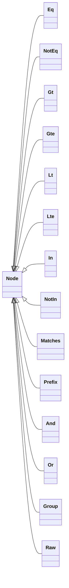
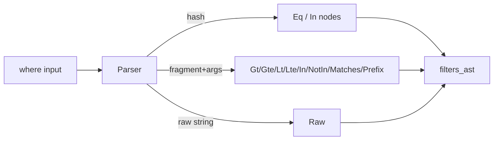

[← Back to Index](./index.md) · [Relation](./relation.md) · [Materializers](./materializers.md)

# Query DSL (Predicate AST)

The Predicate AST models query predicates in a compiler‑agnostic, immutable structure under `SearchEngine::AST`. It separates predicate construction from compilation to Typesense `filter_by`, enabling safer composition, inspection, and future optimizations.

## Overview

- **Safety**: Values are carried as plain Ruby data; quoting/escaping is handled later by the compiler/sanitizer.
- **Immutability**: All nodes are frozen on construction; arrays are deep‑frozen to avoid accidental mutation.
- **Uniform interface**: Nodes expose `#type` and consistent accessors (`#field`, `#value`, `#values`, `#children`, etc.).
- **Debuggable**: Stable `#to_s` and compact `#inspect` shapes for logging.

## Node catalog

- **Comparison**: `Eq`, `NotEq`, `Gt`, `Gte`, `Lt`, `Lte` — binary nodes with `field`, `value`.
- **Membership**: `In`, `NotIn` — binary nodes with `field`, `values` (non‑empty Array).
- **Pattern**: `Matches` (regex‑like; stores pattern source), `Prefix` (string begins‑with) — binary nodes with `field`, `pattern/prefix`.
- **Boolean**: `And`, `Or` — N‑ary nodes over one or more children; `nil` dropped; same‑type nodes flattened.
- **Grouping**: `Group` — wraps a single child to preserve explicit precedence.
- **Escape hatch**: `Raw` — raw string fragment passed through by the compiler.



## Builders

Ergonomic constructors are exposed as module functions on `SearchEngine::AST`:

- `eq(field, value)` / `not_eq(field, value)`
- `gt(field, value)` / `gte(field, value)` / `lt(field, value)` / `lte(field, value)`
- `in_(field, values)` / `not_in(field, values)`
- `matches(field, pattern)` (accepts `String` or `Regexp`; stores `source` only)
- `prefix(field, prefix)`
- `and_(*nodes)` / `or_(*nodes)`
- `group(node)`
- `raw(fragment)`

### Validations

- `field` must be non‑blank `String`/`Symbol`.
- `values` must be a non‑empty `Array` (for membership nodes).
- `pattern` must be `String`/`Regexp`; only the regex source is stored.
- Boolean nodes require ≥ 1 child after dropping `nil`; nested same‑type nodes are flattened.

## Immutability & equality

- All nodes `freeze` on construction; internal arrays are deep‑frozen.
- Nodes compare by value (`#==`, `#eql?`) and have stable `#hash`, so they can be used as Hash keys or in Sets.

## Debugging

- `to_s` emits a human‑friendly outline, e.g., `and(eq(:active, true), in(:brand_id, [1, 2]))`.
- `inspect` uses a compact `#<AST ...>` shape with truncated payloads.
- No quoting/escaping occurs here; the compiler performs adapter‑specific formatting.

## Where it fits

`Relation#where` accepts Hash, raw String, and SQL‑ish fragment+args. The parser converts these inputs into AST nodes and stores them alongside legacy string filters. A later compiler pass will prefer AST when present.

### Parsing examples

```ruby
Parser.parse({ id: 1 }, klass: Product)              # => AST.eq(:id, 1)
Parser.parse(["price > ?", 100], klass: Product)    # => AST.gt(:price, 100)
Parser.parse("brand_id:=[1,2,3]", klass: Product)   # => AST::Raw("brand_id:=[1,2,3]")
```

### Input → AST flow



Note: field names are validated against the model's declared `attributes`. Raw strings are accepted as an escape hatch and bypass validation.

See also: [Relation](./relation.md) · [Materializers](./materializers.md)
