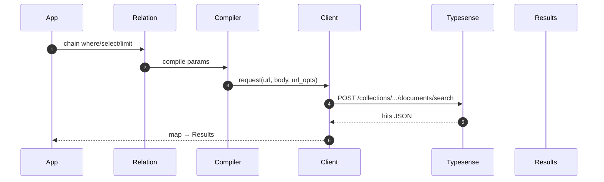

[← Back to Index](./index.md)

# Quickstart

This is the fastest path from zero to a working search using this gem. In a few minutes you will
install the gem, set minimal configuration, define a tiny model, and run your first query using the
Client/Relation APIs (no cURL).

## Prerequisites

- Ruby 3.1+ and Rails 6.1+ running in your host app
- A reachable Typesense node (host/port/protocol); default port is 8108
- `TYPESENSE_API_KEY` set in your environment (keep secrets out of code)
- A Typesense collection and schema already created; see a minimal example in
  [Schema](./schema.md)

## Install the gem

```ruby
# Gemfile
gem "search_engine", path: "./"
```

Then run Bundler to install dependencies in your host app.

## Configure the initializer

```ruby
# config/initializers/search_engine.rb
SearchEngine.configure do |c|
  c.host = ENV.fetch("TYPESENSE_HOST", "localhost")
  c.port = 8108; c.protocol = "http"; c.api_key = ENV.fetch("TYPESENSE_API_KEY")
  c.default_query_by = "name, description"
end
```

- `host`/`port`/`protocol`: where your Typesense node is reachable; defaults are safe for localhost.
- `api_key`: read from `ENV.fetch("TYPESENSE_API_KEY")` so secrets never live in code.
- `default_query_by`: default fields used when you do not pass `query_by` explicitly.

@see [Configuration](./configuration.md) for all options and ENV mapping.

## Define a minimal model

```ruby
class SearchEngine::Product < SearchEngine::Base
  collection "products"
  attribute :id, :integer
  attribute :name, :string
end

SearchEngine::Product.where(name: "milk").select(:id, :name).limit(5).to_a
```

Ensure your Typesense `products` collection exists with at least `id` (int) and `name` (string).

## First query (curl-free)

Open `rails console` and paste the trailing line from the snippet above. It runs against Typesense
and returns up to 5 `Product` records with only `id` and `name` hydrated. This uses the
Relation → Client stack under the hood.

## Request flow



## Next steps

- [Multi‑search](./multi_search.md): run multiple searches in one network call.
- [JOINs](./joins.md): join related collections and select nested fields.
- [Grouping](./grouping.md): group results and aggregate with counts.

## Troubleshooting

- Missing `TYPESENSE_API_KEY`: set the ENV var before boot; see
  [Configuration → ENV mapping](./configuration.md#env-mapping). Tip: the CLI doctor checks this.
- Connection refused or timeout: verify `host`/`port`/`protocol`; see the
  [CLI → Doctor](./cli.md#doctor-flow).
- Unknown field errors: declare attributes on the model or adjust selection; see
  [Field selection → Guardrails](./field_selection.md#guardrails-errors).

## Related links

- [Installation](./installation.md)
- [Configuration](./configuration.md)
- [Client](./client.md)
- [Observability](./observability.md) — events, logging subscriber, OpenTelemetry
- [DX](./dx.md) — helpers: `dry_run!`, `to_params_json`, `to_curl`
- [Relation](./relation.md) — chaining DSL used above
