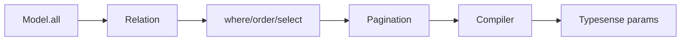
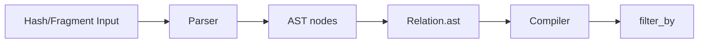

[← Back to Index](./index.md) · [Client](./client.md) · [Compiler](./compiler.md) · [Presets](./presets.md) · [Observability](./observability.md) · [Materializers](./materializers.md) · [Query DSL](./query_dsl.md) · [Debugging](./debugging.md) · [Curation](./curation.md)

> See also: [Debugging & Explain](./debugging.md)

# Relation

Relation is an immutable, chainable query object bound to a model class. It accumulates normalized query state without mutating previous instances.

## Quick start

```ruby
class SearchEngine::Product < SearchEngine::Base; end

r1 = SearchEngine::Product.all
r2 = r1.where(category: 'milk').order(:name).select(:id, :name).page(2).per(10)
# r1 is unchanged
r1.object_id != r2.object_id #=> true
r1.empty?                    #=> true
```

## Immutability

Every chainer creates a new instance via copy-on-write. The original relation remains unchanged.

```ruby
r1 = SearchEngine::Product.all
r2 = r1.where(price: 10)
r1.object_id #=> 701...
r2.object_id #=> 702...
r1.empty?     #=> true
r2.empty?     #=> false
```

## API

- **all**: returns the relation itself (parity with AR).
- **where(*args)**: add filters. Accepts Hash, String/Symbol, arrays thereof.
- **order(value)**: add order expressions. Accepts Hash or String.
- **select(*fields)** / **exclude(*fields)** / **reselect(*fields)**: field selection DSL. See [Field Selection](./field_selection.md) and [JOINs](./joins.md#nested-field-selection-for-joined-collections).
- **limit(n)**, **offset(n)**, **page(n)**, **per(n)**: numeric setters; coerced with validation (see below).
- **options(opts = {})**: shallow-merge additional options for future adapters.
- **empty?**: true when state equals the default empty state.
- **inspect**: concise single-line summary; shows only non-empty keys.

See [Materializers](./materializers.md) for execution methods (`to_a`, `each`, `first`, `last`, `take`, `pluck`, `ids`, `count`, `exists?`).

## Lifecycle



See also: [Compiler](./compiler.md)

See [Client](./client.md) for execution context.

---

## Predicates as AST

`Relation#where` parses inputs into a Predicate AST via the [Query DSL](./query_dsl.md) and stores nodes in `ast` (authoritative). Legacy string fragments are preserved for backward compatibility, but compilation prefers AST when present.

```ruby
rel = SearchEngine::Product.where(id: 1).where(["price > ?", 100])
rel.ast # => [#<AST::Eq field=:id ...>, #<AST::Gt field=:price ...>]
rel.to_typesense_params[:filter_by] # compiled string via Compiler
```

- **Read-only**: `rel.ast` returns a frozen Array.
- **Composition**: multiple `where` calls append with AND semantics (compiled as `AST.and_`).
- **Back-compat**: legacy relations with `filters` are migrated once into `AST::Raw` nodes.

---

## where DSL

The `where` chainer accepts three forms. Each call appends fragments with AND semantics. The relation is immutable and returns a new instance.

```ruby
SearchEngine::Product
  .where(id: 5)
  .where("brand_id:=[1,2,3]")
  .where("price > ?", 100)
```

- **Hash form**: keys must match the model’s declared `attributes`.
  - Scalars become `field:=<quoted>`
  - Arrays become `field:=[<quoted, ...>]`
- **Raw string**: passed through untouched (escape hatch); no validation.
- **Placeholders**: `?` are replaced by safely quoted values. Placeholder count must match args.



Notes:
- Hash keys are validated against model attributes.
- Raw string form is passed through as `AST::Raw`; use with care.
- Placeholder form is sanitized; `?` args are quoted/escaped.

---

## order / select / pagination

```ruby
SearchEngine::Product
  .order(updated_at: :desc)
  .select(:id, :name)
  .page(2).per(20)
```

- **order(value)**: accepts a Hash like `{ field: :asc, other: :desc }` or a String like `"field:asc,other:desc"`. Directions are case-insensitive and normalized to `asc`/`desc`. Duplicate fields are de-duplicated with last-wins semantics.
- **select(*fields)**: accepts symbols/strings or arrays; trims and de-duplicates preserving first occurrence. If the model declares attributes, unknown fields raise. See [Field Selection](./field_selection.md).
- **limit(n) / offset(n)**: numeric. `limit >= 1`, `offset >= 0`.
- **page(n) / per(n)**: numeric. `page >= 1`, `per >= 1`. The `per(n)` method writes to `per_page` internally.

### Mapping to Typesense parameters (performed by a compiler)

- `order(updated_at: :desc)` → `sort_by=updated_at:desc`
- `order(name: :asc, updated_at: :desc)` → `sort_by=name:asc,updated_at:desc`
- `select(:id, :name)` → `include_fields=id,name`
- `limit(50)` → `per_page=50` when `page/per` are not set
- `offset(200)` → `page = (offset / per_page) + 1` when `page/per` are not set
- `page(2).per(20)` → `page=2&per_page=20` (wins over `limit/offset`)

Dedupe behavior: **order last-wins by field**, **select first-wins**.

---

## Compiler and debug helpers

- **Relation#to_typesense_params**: compile immutable state to a Typesense body params Hash. Pure and deterministic. Omits URL-level options (cache knobs are handled by the client).
- **Relation#to_h**: alias of `#to_typesense_params`.
- **Relation#inspect**: concise, stable, and redacted summary `#<SearchEngine::Relation Model=Product filters=2 ast=2 sort="updated_at:desc" select=2 page=2 per=20>`.

### Defaults merged

- **q**: `"*"` unless overridden via `relation.options(q: ...)`.
- **query_by**: from `SearchEngine.config.default_query_by` when present; omitted when `nil`.
- Other body params (e.g., `infix`) follow config defaults.
- URL-level options like **use_cache** and **cache_ttl** are excluded from the compiled body and handled by the client.

### Key order and omission

- Insertion order for stability: `q`, `query_by`, `filter_by`, `sort_by`, `include_fields`, `page`, `per_page` (then any remaining supported keys, e.g., `infix`).
- Keys with empty/nil values are omitted.

### Mapping table

| Relation state                  | Typesense param    | Notes |
| ---                             | ---                | ---   |
| `ast: [..]`                     | `filter_by`        | compiled via Compiler; preferred |
| `filters: [..]`                 | `filter_by`        | joined with ` && ` (fallback) |
| `orders: [..]`                  | `sort_by`          | comma-joined |
| `select: [..]` + `exclude: [..]`| `include_fields`/`exclude_fields` | precedence rules apply |
| `page` / `per_page`             | `page`, `per_page` | if present, they win |
| `limit` / `offset`              | `page`, `per_page` | fallback: `per_page = limit`; `page = (offset / limit).floor + 1` |
| `options[:q]` or default "*"    | `q`                | always present |
| `config.default_query_by`       | `query_by`         | omitted when nil |


### Examples

```ruby
rel = SearchEngine::Product
        .where(active: true, brand_id: [1,2])
        .order(updated_at: :desc)
        .select(:id, :name)
        .page(2).per(20)

rel.to_typesense_params
# => { q: "*", query_by: "name,description", filter_by: "brand_id:=[1,2] && active:=true", sort_by: "updated_at:desc", include_fields: "id,name", page: 2, per_page: 20 }
```

Note: URL options (e.g., caching knobs) are handled by the [Client](./client.md) via common params, not by the compiler.
