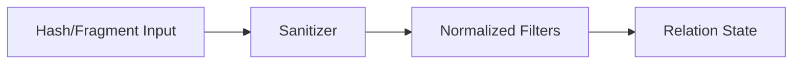

[← Back to Index](./index.md) · [Client](./client.md)

# Relation

Relation is an immutable, chainable query object bound to a model class. It accumulates normalized query state without mutating previous instances.

## Quick start

```ruby
class SearchEngine::Product < SearchEngine::Base; end

r1 = SearchEngine::Product.all
r2 = r1.where(category: 'milk').order(:name).limit(10)
# r1 is unchanged
r1.object_id != r2.object_id #=> true
r1.empty?                    #=> true
```

## Immutability

Every chainer creates a new instance via copy-on-write. The original relation remains unchanged.

```ruby
r1 = SearchEngine::Product.all
r2 = r1.where(price: 10)
r1.object_id #=> 701...
r2.object_id #=> 702...
r1.empty?     #=> true
r2.empty?     #=> false
```

## API

- **all**: returns the relation itself (parity with AR).
- **where(*args)**: add filters. Accepts Hash, String/Symbol, arrays thereof.
- **order(value)**: add order expressions. Accepts Hash or String.
- **select(*fields)**: add selected fields; deduplicates while preserving order.
- **limit(n)**, **offset(n)**, **page(n)**, **per(n)**: numeric setters; coerced with validation (see below).
- **options(opts = {})**: shallow-merge additional options for future adapters.
- **empty?**: true when state equals the default empty state.
- **inspect**: concise single-line summary; shows only non-empty keys.

## Lifecycle

```mermaid
flowchart LR
  A[Model.all] --> B[Relation]
  B --> C[where]
  C --> D[order]
  D --> E[limit / offset / page / per]
  E --> F[Relation (new each step)]
  F --> G[(Future: execute via Client)]
```

See [Client](./client.md) for execution context.

---

## where DSL

The `where` chainer accepts three forms. Each call appends fragments with AND semantics. The relation is immutable and returns a new instance.

```ruby
SearchEngine::Product
  .where(id: 5)
  .where("brand_id:=[1,2,3]")
  .where("price > ?", 100)
```

- **Hash form**: keys must match the model’s declared `attributes`.
  - Scalars become `field:=<quoted>`
  - Arrays become `field:=[<quoted, ...>]`
- **Raw string**: passed through untouched (escape hatch); no validation.
- **Placeholders**: `?` are replaced by safely quoted values. Placeholder count must match args.



Notes:
- Hash keys are validated against model attributes.
- Raw string form is passed through; use with care.
- Placeholder form is sanitized; `?` args are quoted/escaped.

---

## order / select / pagination

```ruby
SearchEngine::Product
  .order(updated_at: :desc)
  .select(:id, :name)
  .page(2).per(20)
```

- **order(value)**: accepts a Hash like `{ field: :asc, other: :desc }` or a String like `"field:asc,other:desc"`. Directions are case-insensitive and normalized to `asc`/`desc`. Duplicate fields are de-duplicated with last-wins semantics.
- **select(*fields)**: accepts symbols/strings or arrays; trims and de-duplicates preserving first occurrence. If the model declares attributes, unknown fields raise.
- **limit(n) / offset(n)**: numeric. `limit >= 1`, `offset >= 0`.
- **page(n) / per(n)**: numeric. `page >= 1`, `per >= 1`. The `per(n)` method writes to `per_page` internally.

### Mapping to Typesense parameters (performed by a later compiler step)

- `order(updated_at: :desc)` → `sort_by=updated_at:desc`
- `order(name: :asc, updated_at: :desc)` → `sort_by=name:asc,updated_at:desc`
- `select(:id, :name)` → `include_fields=id,name`
- `limit(50)` → (compiler will map to) `per_page=50` when `page/per` are not set
- `offset(200)` → (compiler will map to) `page = (offset / per_page) + 1` when `page/per` are not set
- `page(2).per(20)` → `page=2&per_page=20` (wins over `limit/offset`)

Dedupe behavior: **order last-wins by field**, **select first-wins**.
