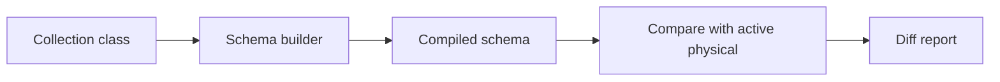
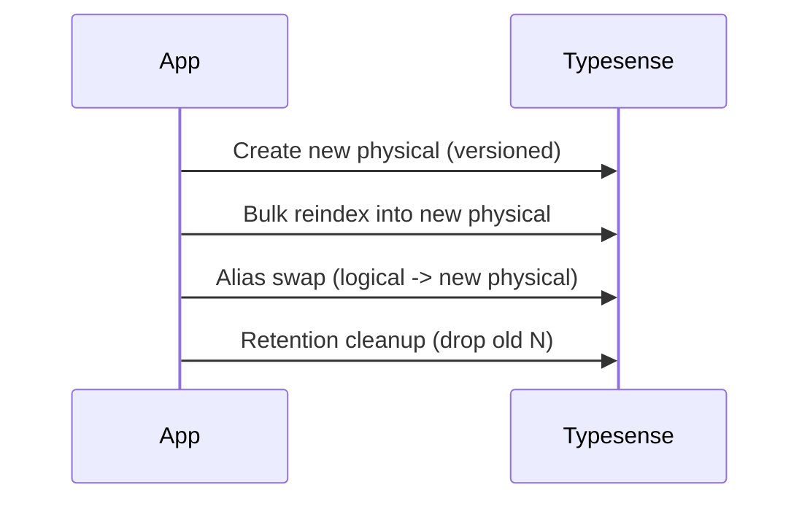

[← Back to Index](./index.md) · [Indexer](./indexer.md)

# Schema Compiler & Diff

The schema layer turns a model class (our DSL) into a Typesense-compatible schema hash and compares it to the live, currently aliased physical collection to surface drift.



## API

- `SearchEngine::Schema.compile(klass)` → returns a Typesense-compatible schema hash built from the DSL. Pure and deterministic (no network I/O).
- `SearchEngine::Schema.diff(klass)` → resolves alias → physical, fetches the live schema, and returns a structured diff plus a compact human summary.
- `SearchEngine::Schema.apply!(klass)` → create new physical, reindex, atomically swap alias, enforce retention; returns `{ logical, new_physical, previous_physical, alias_target, dropped_physicals }`.
- `SearchEngine::Schema.rollback(klass)` → swap alias back to previous retained physical; returns `{ logical, new_target, previous_target }`.

Both methods are documented with YARD. Keys are returned as symbols; empty/nil values are omitted. The returned schema is deeply frozen.

## Type mapping (DSL → Typesense)

- **:string** → `string`
- **:integer** → `int64` (chosen consistently for wider range)
- **:float / :decimal** → `float`
- **:boolean** → `bool`
- **:time / :datetime** → `string` (ISO8601 timestamps)
- Arrays like `[:string]` → `string[]`

## Collection options

If declared in the DSL in the future, the builder may include top-level options like `default_sorting_field`, `token_separators`, `symbols_to_index`. Today, these are omitted to avoid noisy diffs.

## Diff shape

```text
{
  collection: { name: String, physical: String },
  added_fields: [ { name: String, type: String }, ... ],
  removed_fields: [ { name: String, type: String }, ... ],
  changed_fields: { "field" => { "type" => [compiled, live] } },
  collection_options: { /* option => [compiled, live] */ }
}
```

- Field comparison is name-keyed and order-insensitive.
- Only changed keys appear under `changed_fields`.
- When the live collection is missing, `added_fields` contain all compiled fields and `collection_options` includes `live: :missing`.

## Pretty print

The human summary includes:
- **Header**: logical and physical names
- **+ Added fields**: `name:type`
- **- Removed fields**: `name:type`
- **~ Changed fields**: `field.attr compiled→live`
- **~ Collection options**: shown only when differing

Example (no changes):

```text
Collection: products
No changes
```

## Lifecycle (Blue/Green with retention)



- Physical name format: `"#{logical}_YYYYMMDD_HHMMSS_###"` (3-digit zero-padded sequence).
- Alias equals the logical name (e.g., `products`). Swap is performed via a single upsert call, which the server handles atomically.
- Idempotent: if alias already points to the new physical, swap is a no-op.
- Reindexing is required. Provide a block to `apply!` or implement `klass.reindex_all_to(physical_name)` to perform bulk import. On failure, no alias swap occurs and the new physical remains for inspection.

### Retention

- Global default: keep none.

```ruby
SearchEngine.configure { |c| c.schema.retention.keep_last = 0 }
```

- Per-collection override:

```ruby
class SearchEngine::Product < SearchEngine::Base
  schema_retention keep_last: 2
end
```

After a successful swap, older physicals that match the naming pattern and are not the alias target are ordered by embedded timestamp (desc). Everything beyond the first `keep_last` is deleted. The alias target is never deleted.

### Rollback

`SearchEngine::Schema.rollback(klass)` will swap the alias back to the most recent retained physical (behind the current). If no previous physical exists, it raises an error (e.g., when `keep_last` is 0). No collections are deleted during rollback.

See also: [Client](./client.md), [Configuration](./configuration.md), and [Compiler](./compiler.md).
