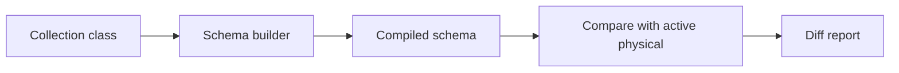

[← Back to Index](./index.md) · [Compiler](./compiler.md)

# Schema Compiler & Diff

The schema layer turns a model class (our DSL) into a Typesense-compatible schema hash and compares it to the live, currently aliased physical collection to surface drift.



## API

- `SearchEngine::Schema.compile(klass)` → returns a Typesense-compatible schema hash built from the DSL. Pure and deterministic (no network I/O).
- `SearchEngine::Schema.diff(klass)` → resolves alias → physical, fetches the live schema, and returns a structured diff plus a compact human summary.

Both methods are documented with YARD. Keys are returned as symbols; empty/nil values are omitted. The returned schema is deeply frozen.

## Type mapping (DSL → Typesense)

- **:string** → `string`
- **:integer** → `int64` (chosen consistently for wider range)
- **:float / :decimal** → `float`
- **:boolean** → `bool`
- **:time / :datetime** → `string` (ISO8601 timestamps)
- Arrays like `[:string]` → `string[]`

## Collection options

If declared in the DSL in the future, the builder may include top-level options like `default_sorting_field`, `token_separators`, `symbols_to_index`. Today, these are omitted to avoid noisy diffs.

## Diff shape

```text
{
  collection: { name: String, physical: String },
  added_fields: [ { name: String, type: String }, ... ],
  removed_fields: [ { name: String, type: String }, ... ],
  changed_fields: { "field" => { "type" => [compiled, live] } },
  collection_options: { /* option => [compiled, live] */ }
}
```

- Field comparison is name-keyed and order-insensitive.
- Only changed keys appear under `changed_fields`.
- When the live collection is missing, `added_fields` contain all compiled fields and `collection_options` includes `live: :missing`.

## Pretty print

The human summary includes:
- **Header**: logical and physical names
- **+ Added fields**: `name:type`
- **- Removed fields**: `name:type`
- **~ Changed fields**: `field.attr compiled→live`
- **~ Collection options**: shown only when differing

Example (no changes):

```text
Collection: products
No changes
```

## Caveats

- Alias resolution uses the `aliases` endpoint; if not found, the logical name is treated as physical.
- Options not present in our DSL are intentionally ignored in comparisons to keep diffs focused on actionable changes.
- Network I/O (alias resolution and live schema fetch) occurs only in `diff`.

See also: [Client](./client.md), [Configuration](./configuration.md), and [Compiler](./compiler.md).
