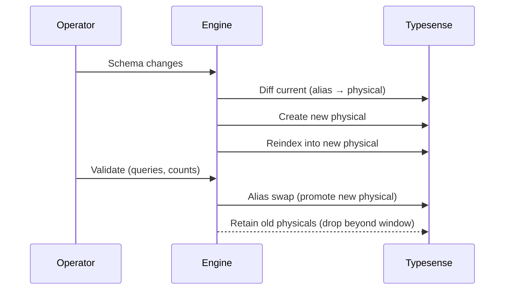

[← Back to Index](./index.md)

# Schema & Indexer — end-to-end guide

This guide describes an operational workflow for blue/green schema apply, full and
partitioned reindex, retention management, and safe delete‑stale.

- Audience: operators and engineers running indexing in production
- Scope: engine APIs and CLI tasks; network‑safe, redaction‑aware

Related: [Schema](./schema.md), [Indexer](./indexer.md), [CLI](./cli.md),
[Observability](./observability.md), [DX](./dx.md), [Testing](./testing.md)

## Overview

Blue/green keeps downtime minimal and rollbacks safe:

- Apply schema changes to a new physical collection (versioned name)
- Rebuild data (full or partitioned) into that new physical
- Validate correctness and performance
- Atomically swap the alias to promote the new physical
- Retain prior physicals for a short window; drop beyond retention

See: [Schema → Lifecycle](./schema.md#lifecycle-bluegreen-with-retention),
[CLI](./cli.md#behavior-summary), [Observability](./observability.md#observability)

[Back to top ⤴](#schema--indexer--end-to-end-guide)

## Schema lifecycle: diff → apply → validate → swap → rollback

- Physical naming: `"<logical>_YYYYMMDD_HHMMSS_###"` (timestamp + sequence). Logical name
  is stable and exposed via alias (e.g., `products`).
- Diff compares compiled vs live (aliased physical): fields, types, and selected options.
  Intentionally immutable aspects (e.g., field type narrowing) are flagged for safe migration.
- Apply creates a new physical collection; reindex populates it; failures leave the alias
  untouched for inspection.
- Validation before swap: sample queries, mapping sanity, counts/order checks on key paths.
  Prefer `dry_run!` and offline stub client for exploratory checks.
- Alias swap: traffic moves atomically to the new physical via an upsert; old physicals
  remain per retention.
- Rollback: re‑point alias to prior retained physical if available; consider documents
  indexed after the swap window.
- Observability hooks (predictive): `search_engine.schema.diff`, `search_engine.schema.apply`,
  `search_engine.alias.swap` (swap often occurs within `schema.apply`). See
  [Observability → Events](./observability.md#observability).

### Alias swap

An alias equals the logical collection name. Promotion swaps the alias target to the new
physical in a single call the server treats atomically. If it already points to the target,
no‑op. Retention never deletes the alias target.

[Back to top ⤴](#schema--indexer--end-to-end-guide)

## Indexer overview: sources, Mapper DSL, partitions, hooks, dispatcher

- Sources: feed batched rows
  - ActiveRecord (ORM) for in‑app queries and scopes
  - SQL for tuned reads and keyset iteration
  - Lambda/stream for external APIs and services
- Mapper DSL: transforms rows to documents (field renames, coercions, joins lookups,
  defaults), validates required fields, and emits mapping metrics.
- Partitions: choose a stable key (e.g., shop, shard, `updated_at` bucket). Full rebuild
  runs once over all data. Partitioned rebuild reduces risk and isolates failures.
- Hooks: `before_partition`/`after_partition` for enrichment, throttling, metrics; must be
  idempotent.
- Dispatcher: fans out partitions inline or via background jobs, with back‑pressure and
  retries; batch size and timeouts are tunable.
- Events (predictive): `search_engine.indexer.enqueue`, `search_engine.indexer.batch_import`,
  `search_engine.indexer.retry`, `search_engine.indexer.complete`. Also see existing events
  `indexer.partition_start`, `indexer.partition_finish`, `indexer.batch_import`.

See: [Indexer](./indexer.md), [Observability](./observability.md), [CLI](./cli.md)

[Back to top ⤴](#schema--indexer--end-to-end-guide)

## CLI tasks & expected outcomes

Use these tasks to drive the lifecycle. They respect configured timeouts, batch sizes,
redaction, and dispatch mode. See [CLI](./cli.md#behavior-summary).

```bash
rails search_engine:schema:apply[products]
rails search_engine:index:rebuild[products]
rails search_engine:index:delete_stale[products]
```

- `schema:apply[products]`
  - What: create new physical → reindex → alias swap → retention cleanup
  - Preconditions: collection registered; API key valid; network reachable
  - Expected: summary with created/updated fields, new/previous physical, retention results
- `index:rebuild[products]`
  - What: full rebuild or partition fan‑out via dispatcher; batches streamed with retries
  - Preconditions: schema exists and alias resolves; sources accessible
  - Expected: summary of batches/partitions processed; retry counts, durations
- `index:delete_stale[products]`
  - What: delete documents not in the current source‑of‑truth snapshot via your
    `stale_filter_by`
  - Preconditions: `stale_filter_by` defined; strict mode or dry‑run configured as needed
  - Expected: summary of candidates and deletions (or preview in dry‑run)

[Back to top ⤴](#schema--indexer--end-to-end-guide)

## Apply flow



[Back to top ⤴](#schema--indexer--end-to-end-guide)

## Partitioned rebuild flow

```mermaid
sequenceDiagram
  participant Disp as Dispatcher
  participant Plan as Partition planner
  participant W as Workers
  participant Map as Mapper
  participant Obs as Observability
  Disp->>Plan: Enumerate partitions
  Plan-->>Disp: Keys
  Disp->>W: Fan‑out per partition
  W->>Map: Map rows → docs (per batch)
  W->>W: Batch import with retries/back‑pressure
  W->>Obs: Metrics and events
  W-->>Disp: Results; errors rerouted to retries
  Disp-->>Obs: Finalize summary
```

[Back to top ⤴](#schema--indexer--end-to-end-guide)

## Retention & delete‑stale

- Retention: keep a limited number of recent physicals (configurable globally and per
  collection) for debug/rollback. Old physicals beyond the window are dropped; the alias
  target is never dropped. See [Schema → Retention](./schema.md#retention).
- Delete‑stale: identify documents that should no longer exist based on a source‑of‑truth
  snapshot. Implement `stale_filter_by` to build a `filter_by` string (e.g., archived flag,
  partition + archived, date thresholds). Strict mode prevents catch‑alls.
- Guardrails: dry‑run preview, maximum delete thresholds, and sampling pre‑checks before
  destructive steps. Logs are redacted and include a short filter hash.

See: [Indexer → Stale Deletes](./indexer.md#stale-deletes), [CLI → Safety notes](./cli.md#safety-notes)

### Safety thresholds

Configure strict mode and optional estimation to avoid large, accidental purges. Exits with
non‑success when thresholds are violated under strict settings.

[Back to top ⤴](#schema--indexer--end-to-end-guide)

## Safety, performance & tuning

- Idempotency: imports and hooks must tolerate retries and duplicate batches.
- Retries & back‑pressure: transient failures back off; 413 splits batches; timeouts are
  configurable. Avoid hot partitions by balancing partition keys.
- Tuning knobs: batch size, concurrency, dispatch mode, and request timeouts.
- Query behavior: schema changes can alter ranking/filtering; coordinate with presets and
  curation for consistent results.

See: [Indexer → Retries & backoff](./indexer.md#retries--backoff),
[Configuration → Timeouts & retries](./configuration.md#timeouts--retries)

[Back to top ⤴](#schema--indexer--end-to-end-guide)

## Debugging & DX

- Use `dry_run!` on representative relations to validate mapping and query readiness
  against the new schema without I/O.
- Use `explain` to surface selection, grouping, joins, and potential conflicts; use
  `to_curl` to reproduce requests (redacted).
- Doctor task: `search_engine:doctor` validates environment and connectivity.

See: [DX](./dx.md), [CLI](./cli.md), [Testing → Stub client](./testing.md#quick-start)

[Back to top ⤴](#schema--indexer--end-to-end-guide)

## Troubleshooting

- Insufficient privileges for schema tasks → see [Schema permissions](#schema-permissions)
- Alias not found or mispointed → see [Alias swap](#alias-swap)
- Indexer job failure (batch too large, timeout) → see
  [Indexer tuning](./indexer.md#retries--backoff) and [Retries](./indexer.md#retries--backoff)
- Delete‑stale threshold exceeded → see [Safety thresholds](#safety-thresholds)

### Schema permissions

Ensure the API key can create collections, update aliases, and delete collections. Validate
with `search_engine:doctor`; confirm host/port/protocol and timeouts. For CI, inject keys via
ENV. See [CLI → Doctor](./cli.md#doctor-flow) and [Configuration](./configuration.md).

[Back to top ⤴](#schema--indexer--end-to-end-guide)

---

Related links: [Schema](./schema.md), [Indexer](./indexer.md), [CLI](./cli.md),
[Observability](./observability.md), [DX](./dx.md), [Testing](./testing.md),
[Relation guide](./relation_guide.md)
